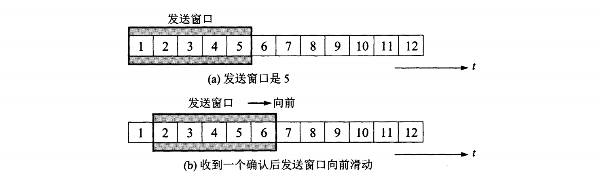
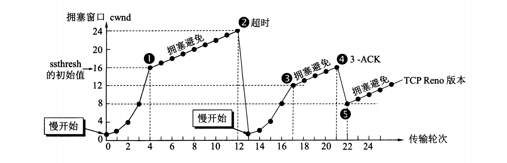
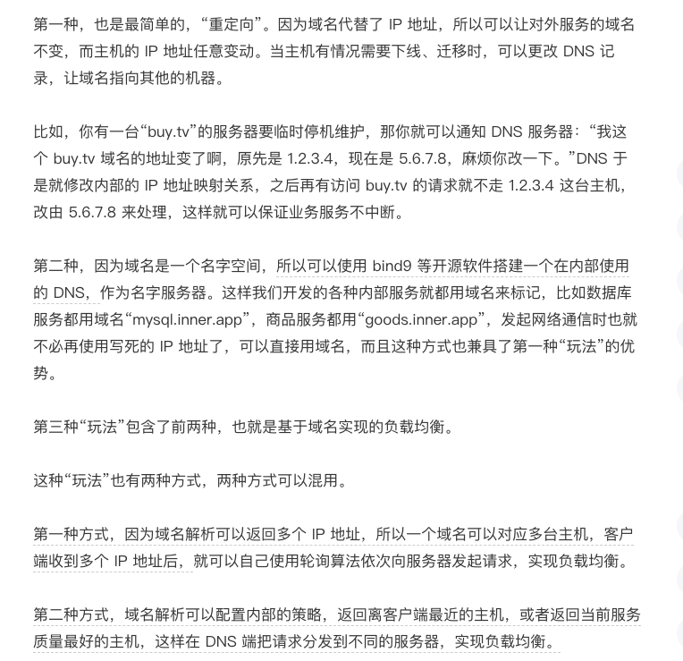
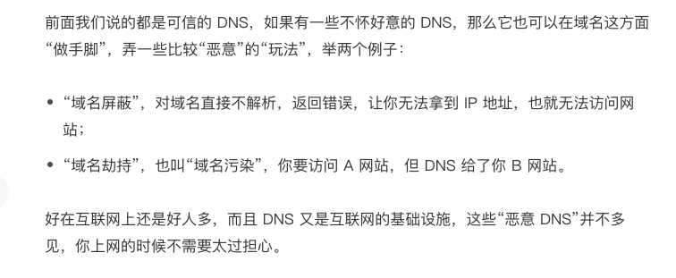
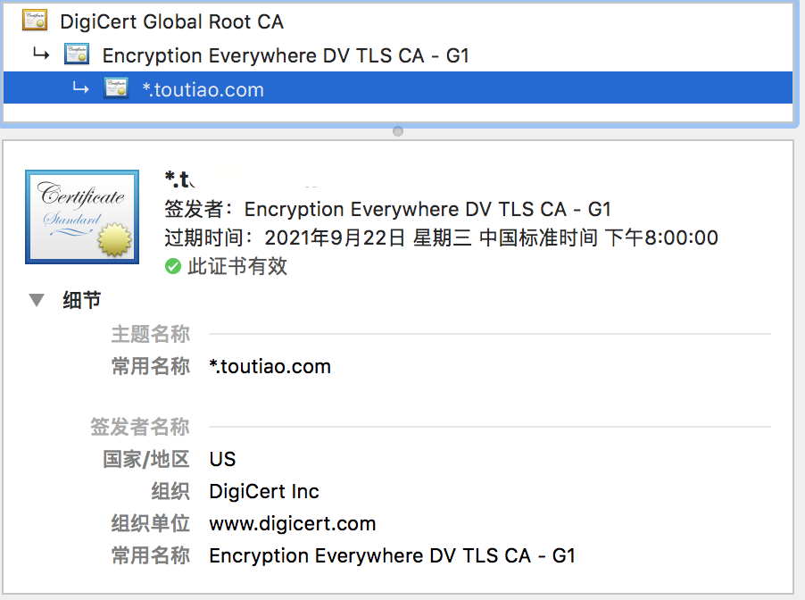

# 1、点击浏览器请求过程


# 2、IP是怎么来的 DHCP

## 网络请求过程相同网段和不同网段

1. <font color=red size=5x>**网络请求首先检查是否是相同网段,如果是相同网段,会发送ARP请求,获取mac地址**</font>

2. <font color=r size=5x>**如果不是同一网段回请求网关,如果没配置网关,根本发不出去**</font>

<font color=red size=5x></font>


## 动态主机配置DHCP

动态主机配置协议（Dynamic Host Configuration Protocol），简称 DHCP。

1. <font color=red size=5x>**请求地址发送0.0.0.0的广播包,目标地址为255.255.255.255,广播包封装了 UDP，UDP 封装了 BOOTP。其实 DHCP 是 BOOTP 的增强版**</font>

2. <font color=r size=5x>**即使有多个DHCP服务器,总会有第一个去响应,给出ip**</font>

3. <font color=red size=5x>**请求的ip收到后,回应DHCP收到,==DHCP服务器收到后回应ACK,客户机表示收到,并将信息存储==**</font>

4. <font color=red size=5x>**客户机会在过去50%的时候去续租,根据新的回应跟新配置信息**</font>


# 3、物理层

物理层为设备之间的[数据通信](https://baike.baidu.com/item/数据通信/897073)提供传输媒体及互连设备，为[数据传输](https://baike.baidu.com/item/数据传输/2987565)提供可靠的环境。


# 4、数据链路层

即MAC层,媒体访问控制协议

帧是数据链路层的传送单位

数据链路层主要有两个功能 ：帧编码和误差纠正控制。帧编码意味着定义一个包含信息频率、位同步、源地址、目标地址以及其他控制信息的数据包。数据链路层协议又被分为两个子层 ：[逻辑链路控制](https://baike.baidu.com/item/逻辑链路控制/3530198)（LLC）协议和[媒体访问控制](https://baike.baidu.com/item/媒体访问控制/9719321)（MAC）协议。


# ==5、传输层==

传输层包含tcp和udp，也是学习的重点

## 1⃣️ TCP/IP模型和OSI模型简介


示意图


> <font color=red size=5x>**第一层链接层**</font>，也是数据链路层或者MAC层，底层以太网 、wife等原始数据包的发送
>
> <font color=red size=5x>**第二层网际层**</font>，机器MAC转换为IP地址构成巨大互联网交互、网络里找到设备在转化为MAC地址应答
>
> <font color=red size=5x>**第三层传输层**</font>，TCP、UDP等传输协议
>
> <font color=red size=5x>**第四层应用层**</font>，经过下层的封装，层协议较多，http、sftp、smtp、ssh等等


知道了tcp/ip的层级分布，那么我们看一下点击浏览器的过程在此都做了什么


> 1. <font color=red size=5x>**当收到一个请求，也就是process_layer2(buffer)**</font>的时候查看MAC头是否和自己是一样的，一样说明是发送给自己的
> 2. <font color=red size=5x>**然后调用process_layer3(buffer)**</font>，二层MAC已经被摘除，查看三层的ip头是否和自己的ip是一样的，一样的则是发给自己的，不是则转发出去
> 3. <font color=red size=5x>**假设用的tcp协议**</font>，process_tcp(buffer)，查看tcp头信息，这里有端口号，分发给不同的坚挺端口进行处理
> 4. <font color=red size=5x>**进行请求处理**</font>
> 5. <font color=red size=5x>**然后调用 send_layer3(buffer)。**</font>Buffer 里面已经有了 HTTP 的头和内容，以及 TCP 的头。在这个函数里面加一个 IP 的头，记录下源 IP 的地址和目标 IP 的地址。
> 6. <font color=red size=5x>**然后调用 send_layer2(buffer)。**</font>Buffer 里面已经有了 HTTP 的头和内容、TCP 的头，以及 IP 的头。这个函数里面要加一下 MAC 的头，记录下源 MAC 地址，得到的就是本机器的 MAC 地址和目标的 MAC 地址
> 7. <font color=red size=5x>**整理好信息，从网口发出**</font>


介绍完TCP/IP的四层模型，我们来看下和iso的osi的七层网络模型


> 第一层：物理层，TCP/IP 里无对应；
>
> 第二层：数据链路层，对应 TCP/IP 的链接层；
>
> 第三层：网络层，对应 TCP/IP 的网际层；
>
> 第四层：传输层，对应 TCP/IP 的传输层；
>
> 第五、六、七层：统一对应到 TCP/IP 的应用层。


## 2⃣️ 数据链路层

三个主要职责

> 1. <font color=green size=5x>**为IP模块发送和接收IP数据报**</font>
> 2. <font color=green size=5x>**为ARP模块发送ARP和接收ARP应答**</font>
> 3. <font color=green size=5x>**为RARP发送RARP请求和接收RARP应答**</font>

- IP协议大家都知道位于TCP/IP模型中中的网际层，上层是传输层，下层是链接层

- ARP叫做地址解析协议，使用IP地址换取MAC地址的一种协议
  - 当一个请求发出的时候，请求地址检查目的地址是否在同一网段，不再的话广播请求网关（通常是路由器），网关收到请求，回复收到加上MAC地址，发送到下一个中转或者目的主机
- RARP叫做逆地址解析协议
- 还有很多其他的协议，以太网，PPP协议（adsl宽带）以及loopback协议

### 1、IP协议

>  IP协议是TCP/Ip协议的狠心，所有的TCP、UDP、IGCP的数据都是以Ip数据格式传输的。
>
> IP协议是不可靠的，IP协议没有提供一种数据传达以后的处理机制，这被认为是上层协议TCP或者UDP要做的事
>
> 所以TCP事一个可靠的协议，而UDP就没有那么可靠。

**IP协议头信息**


> **版本号**：IP协议的版本，例如ipv4值为4
>
> **头部长度**：4位最大长度为0xF，盖子短表示单位事字节（4字节）
>
> **服务类型**：3位优先权字段+4位TOS字段+1位保留字段，4位TOS字段分别表示最小延时、最大吞吐量、最高可靠性、最小费用，其中最多有一个能置为1。应用程序根据实际需要来设置 TOS值，如ssh和telnet这样的登录程序需要的是最小延时的服务，文件传输ftp需要的是最大吞吐量的服务
>
> **总长度**：指整个IP数据报的长度，单位字节，即IP数据报的最大长度为65535字节（2的16次方），==由于MTU的限制，长度超过MTU的数据报将被分片传输==，---最大传输单元（Maximum Transmission Unit，MTU）用来通知对方所能接受[数据服务](https://baike.baidu.com/item/数据服务/23724818)[单元](https://baike.baidu.com/item/单元/32922)的最大尺寸，说明发送方能够接受的[有效载荷](https://baike.baidu.com/item/有效载荷/3653893)大小
>
> **标识**：唯一地标识主机发送的每一个数据报，其初始值是随机的，每发送一个数据报其值就加1。同一个数据报的所有分片都具有相同的标识值
>
> **标志**: 位1保留，位2表禁止分片(DF)，若设置了此位，IP模块将不对数据报进行分片，在此情况下若IP数据报超过MTU，IP模块将丢弃数据报并返回一个ICMP差错报文；位3标识更多分片(MF)，除了数据报的最后一个分片，其他分片都要把它设置为1
>
> 位偏移：分片相对原始IP数据报数据部分的偏移。实际的偏移值为该值左移3位后得到的，所以除了最后一个IP数据报分片外，每个IP分片的数据部分的长度都必须是8的整数倍
>
> **生存时间**:：数据报到达目的地之前允许经过的路由器跳数。TTL值被发送端设置，常设置为64。数据报在转发过程中每经过一个路由该值就被路由器减1.当TTL值为0时，路由器就将该数据包丢弃，并向源端发送一个ICMP差错报文。TTL可以防止数据报陷入路由循环
>
> **协议**: 区分IP协议上的上层协议。在Linux系统的/etc/protocols文件中定义了所有上层协议对应的协议字段，ICMP为1，TCP为6，UDP为17
>
> **头部校验和**： 由发送端填充接收端对其使用CRC算法校验，检查IP数据报头部在传输过程中是否损坏
>
> **源IP地址和目的IP地址**: 表示数据报的发送端和接收端。一般情况下这两个地址在整个数据报传递过程中保持不变，不论中间经过多少个路由器
>
>  选项：可变长的可选信息，最多包含40字节。选项字段很少被使用。可用的IP可选项有：
>   a. 记录路由: 记录数据包途径的所有路由的IP，这样可以追踪数据包的传递路径
>   b. 时间戳: 记录每个路由器数据报被转发的时间或者时间与IP地址对，这样就可以测量途径路由之间数据报的传输的时间
>   c. 松散路由选择: 指定路由器的IP地址列表数据发送过程中必须经过所有的路由器
>   d. 严格路由选择: 数据包只能经过被指定的IP地址列表的路由器
>   e. 上层协议(如TCP/UDP)的头部信息
>

​	TTL 8bit ：生存时间，数据报到达目的地之前经过的路由数，每经过一次路由就将该值减1，当TTL位0的时候，路由器就会将该数据报丢弃，8bit最大255，常设置为64


**IP路由选择**

> 最特殊的情况是主机对主机直连，那么主机根本不需要寻找路由，直接传递数据就好，依靠ARP协议广播就可以
>
> 主机经过若干个路由器和目的主机连接，那么路由器就要通过ip包的信息来为ip寻找下一个合适的目标来进行传递，如果数据包的TTL到期就丢弃
>
> 搜索路由表，优先搜索匹配主机，如果能找到和IP地址完全一致的目标主机，则将该包发向目标主机
>
> 搜索路由表，如果匹配主机失败，则匹配同子网的路由器，这需要“子网掩码(1.3.)”的协助。如果找到路由器，则将该包发向路由器。
>
> 搜索路由表，如果匹配同子网路由器失败，则匹配同网号路由器，如果找到路由器，则将该包发向路由器。
>
> 搜索路由表，如果以上都失败了，就搜索默认路由，如果默认路由存在，则发包
>
> 如果都失败了，就丢掉这个包。

　　这再一次证明了，ip包是不可靠的。因为它不保证送达。

**ARP协议**

> 1. ARP协议是一种解析协议，本来主机是完全不知道这个IP在哪个主机的哪个接口
> 2. 当主机要发一个ip包的时候，会首先查一下自己的ARP高速缓存(ip-MAC地址缓存对应表)
> 3. 如果查询的IP-MAC值对不存在，那么主机就像网络发送一个ARP广播协议包，这个包里面包含要查询的ip地址
> 4. 收到广播包的主机都查询自己的ip地址，如果发现和自己一样，那么就准备一个包含自己MAC地址的ARP包传送给ARP广播的主机
> 5. 而广播主机收到后，就放入缓存ARP的缓存中，发送官博的主机就会用心的ARP缓存数据发送数据包

任何系统

```go
arp -a
```


```go
? (169.254.0.32) at 0:f4:8d:a0:9:db on en0 [ethernet]
? (169.254.0.171) at 5c:80:b6:45:a2:63 on en0 [ethernet]
? (169.254.8.69) at 0:f4:8d:db:36:81 on en0 [ethernet]
? (169.254.9.124) at 9a:e7:bf:d:d4:a6 on en0 [ethernet]
? (169.254.10.1) at 72:d7:e6:bb:87:90 on en0 [ethernet]
? (169.254.11.88) at 50:e0:85:50:e0:d3 on en0 [ethernet]
? (169.254.14.160) at a0:c5:89:a3:fb:56 on en0 [ethernet]
? (169.254.17.14) at 2:c6:7e:4a:d2:36 on en0 [ethernet]
? (169.254.17.242) at 14:20:5e:10:b5:3c on en0 [ethernet]
```

ARP的高速缓存时间是20分钟


### 2、ICMP协议

百度百科的解释

> ICMP（Internet Control Message Protocol）Internet控制[报文](https://baike.baidu.com/item/报文/3164352)协议。它是[TCP/IP协议簇](https://baike.baidu.com/item/TCP%2FIP协议簇)的一个子协议，用于在IP[主机](https://baike.baidu.com/item/主机/455151)、[路由](https://baike.baidu.com/item/路由)器之间传递控制消息。==控制消息是指[网络通](https://baike.baidu.com/item/网络通)不通、[主机](https://baike.baidu.com/item/主机/455151)是否可达、[路由](https://baike.baidu.com/item/路由/363497)是否可用等网络本身的消息。==  <font color=red size=3x>这些控制消息虽然并不传输用户数据，但是对于用户数据的传递起着重要的作用 </font>font>
>
> ICMP使用IP的基本支持，就像它是一个更高级别的协议，但是，ICMP实际上是IP的一个组成部分，必须由每个IP模块实现。 

> IP协议并不是一个可靠的协议，它不保证数据被送达，那么，自然的，保证数据送达的工作应该由其他的模块来完成。其中一个重要的模块就是ICMP(网络控制报文)协议。

ICMP协议大致分为两类，一种是查询报文，一种是差错报文。其中查询报文有以下几种用途:

1. ping查询

2. 子网掩码查询（用于无盘工作站在初始化自身的时候初始化子网掩码）

3. 时间戳查询（可以用来同步时间）
4. **ICMP**的应用--Traceroute


**IP选路**

IP选路，即IP寻路，就是根据路由表中的记录，来决定当前数据报是直接交付（目的地址属于当前局域网）还是发往下一跳路由（隶属于不同的局域网）。

**静态路由选路**

查看路由表

```go
netstat -rn                                                                                            
Routing tables

Internet:
Destination        Gateway            Flags        Refs      Use   Netif Expire
default            172.16.63.254      UGSc          114        8     en0
10.8/16            10.9.0.1           UGSc            0        0   utun1
10.9/24            10.9.0.104         UGSc          107        0   utun1
10.9/16            10.9.0.1           UGSc            0        0   utun1
10.9.0.104         10.9.0.104         UH              1        0   utun1
10.29.114.134/32   10.9.0.1           UGSc            0        0   utun1
10.47.67.196/32    10.9.0.1           UGSc            0        0   utun1
10.111/16          10.9.0.1           UGSc            0        0   utun1
10.111.179.243/32  10.9.0.1           UGSc            0        0   utun1
10.168.100.103/32  10.9.0.1           UGSc            0        0   utun1
47.52.55.213/32    10.9.0.1           UGSc            0        0   utun1
47.75.96.181/32    10.9.0.1           UGSc            0        0   utun1
47.75.168.58/32    10.9.0.1           UGSc            0        0   utun1
47.91.193.192/32   10.9.0.1           UGSc            0        0   utun1
47.91.223.112/32   10.9.0.1           UGSc            0        0   utun1
47.93.84.213/32    10.9.0.1           UGSc            0        0   utun1
47.96.1.126/32     10.9.0.1           UGSc            0        0   utun1
```

Flags 解析

> U 表明该路由可用
>
> G表明该路由是到一个网关。如果没有这个标志，说明和Destination是直连的，而相应的Gateway应该直接给出Destination的地址。
>
> H表明该路由是到一个主机，如果没有该标志，说明Destination是一个网络，换句话说Destination就应该写成一个网络号和子网号的组合，而不包括主机号(主机号码处为0)，例如 10.9.0.104 
>
> D表明该路由是为重定向报文创建的
>
> M该路由已经被重定向报文修改

这样，IP选路的方式就可以更加具体化了。如下

1. 首先用IP地址来匹配那些带H标志的DestinationIP地址。

2. 如果1失败就匹配那些网络地址。

3. 如果2失败就发送到Default网关


# 6、TCP详解

来回顾一下上一章节的内容


TCP/IP协议的通信过程其实就是对应着的数据==入栈和出栈==的过程，数据发送方每层不断的封装首部和尾部，添加信息，出栈的过程，数据接收方每层不断的拆除首部和尾部，等到最终的数据

以上的以太网首部，更准确应该是MAC头


这一章我们来详细讲TCP

## 1、和UDP区别

既然讲到TCP，那么自然少不了它的好兄弟UDP，我们先来看下他们呢的区别


**面向报文和面向字节流区别**

> **面向报文**的传输方式是**应用层给UDP多长的报文，UDP就照样转发**，即一次发送一个报文，因此应用程序必须选择合适大小的报文，若报文太长，则==需要IP层分片==降低效率
>
> **面向字节流**，虽然应用程序和TCP的监护是一次一个数据块（大小不等），但TCP把应用程序看成是一连串的无结构的字节流，TCP有一个缓冲，当应用程序传递的数据块太长，TCP就可以把它划分的短一些再传输。


**全双工**

> 二台通讯设备之间，允许有双向的资料传输。udp在两台端设备间通信，但与tcp不同的是，udp需要两次连接。也就是说，每一次连接都是单向传输，所以说udp更偏向单工。
>
> tcp不同，一次连接中，双方都可以发送数据，所以是典型的全双工。

## 2、DNS

> DNS属于应用层
>
> 运行在用户主机上的某些应用程序需要将主机名转换为IP地址
>
> ==DNS既有TCP的使用，也有UDP的使用==
>
> ​	区域传输的时候使用的是TCP，其他时候是UDP
>
> ​	区域传输：dns的规范规bai定了2种类型的dns服务器，一个叫主dns服务器，一个叫辅助dns服务器。在一个区中主dns服务器从自己本机的数据文件中读取该区的dns数据信息，而辅助dns服务器则从区的权威dns服务器中读取该区的dns数据信息。当一个辅助dns服务器启动时，它需要与主dns服务器通信，并加载数据信息，这就叫做区传送（zone transfer）

## 3、TCP头信息


<font color=red size=5x>**头部最少占20字节**</font>

**4位头部长度：**标识该tcp头部有多少个32bit字（4字节）因为4位最大能表示15，所以tcp头部最长是60字节

> - URG标志，表示紧急指针是否有效
> - ACK标志，表示确认号是否有效。称携带ACK标志的tcp报文段位确认报文段
> - PSH标志，提示接收端应用程序应该立即从tcp接受缓冲区中读走数据，为接受后续数据腾出空间（如果应用程序不将接收的数据读走，它们就会一直停留在tcp缓冲区中）
> - RST标志，表示要求对方重新建立连接。携带RST标志的tcp报文段为复位报文段。
> - SYN标志，表示请求建立一个连接。携带SYN标志的tcp报文段为同步报文段。
> - FIN标志，表示通知对方本端要关闭连接了。携带FIN标志的tcp报文段为结束报文段。


TCP关注的几个问题

- 顺序问题
- 丢包问题
- 连接维护
- 流量控制
- 拥塞控制
- 粘包问题


## 4、TCP的连接建立


> 1. 一开始双方都处于CLOSE状态
> 2. 客户端发送SYN（表示请求建立连接）seq=x（系列号）给服务端，然后进入SYN_WAIT等待连接建立状态
> 3. 服务端收到回复SYN，seq=x+1，ack=y，进入SYN_RECV(连接等待接收状态)
> 4. 客服端收到SYN和ACK，然发送ACK的ACK之，后回复ACK=y+1 seq=x+1，后处于ESTABLISHED状态
> 5. 服务端收到ACK的ACK进入ESTABLEISHED状态
> 6. 客户端和服务端建立连接

以上为连接建立过程

### 1、为什么需要三次握手？

<font color=red size=5x>**为了防止已失效的连接请求报文==突然==又传到服务器，建立连接，造成服务端资源浪费**</font>

> 具体例子：在有网络延迟的情况下，客户端发送一个请求，在网络中延迟了，到了超时时间后，客户端任务失败，再次发送一个连接请求，这次正常到达服务端，随后，上次那个延迟的连接报文也到达了，如果没有三次握手，那么每来一个请求就建立一次连接，极大的浪费了服务端的资源，而有了三次握手，服务端收到一个请求，就会问客户端这是你的请求吗，客户端回答这个请求已经被抛弃了，然后服务端拒绝这个请求

### 2、包的序号为什么不能从1连续的

<font color=red size=5x>**为了防止已失效的连接请求数据段==突然==又传到服务器，造成数据错误**</font>

> 具体例子：客户端发送数据包1、2、3，但是3出了问题迷路了，1、2到达，服务端确认数据，客户端收到重新传3，此时3的数据发生变化，但是恰巧之前的那个3到达了，造成数据不是想要传输的
>
> 所以数据段的序号设置适合时间变化有关的，可以看成是一个32位的计数器,每4微妙加1,如果重复,大概需要4个小时,那个绕路的包会在TTL时间之后消失


### 3、 传输包顺序问题

> seq由计算机和时间生成的32位的随机序列号
>
> ack：确认序列号，值为seq+1
>
> 1. 客户端每次发送数据，TCP就给每个数据包分配一个序列号（seq=x），并且在一个特定的时间内等待服务器对分配的这个序列号进行确认（ack=x+1）
> 2. 如果客户端在一个特定时间内没有收到服务端的确认，则客户端会重传次数据包


### 4、 丢包问题

> A发送分组M1，发送完就等待B的确认，B收到了就会箱A发送确认，A收到确认后在发送分组M2，以此类推

## 5、可靠传输工作原理

#### 出现差错怎么办？

1、 **数据包传输丢失或者数据包错误**

 - 分组在传入的过程中，B在接收M1检测的时候出现问题，就丢弃，什么也不做，（不通知A收到有差错的包），因为分组有可能在传输过程中出问题，A只要一段时间没收到确认，就会重传，这就是==**超时重传**==
 -  要实现超时重传，就要在每次发包之后设置一个超时计时器，如果在设定内没收到，就重传，否则撤销定时器
 - 此处注意的三个细节
         1. A在发送完分组M1之后要保存其副本，防止超时重传
         2. 分组和确认分组都需要编号，编号是32位置的计数器和时间结合的序列，应答的是序列号+1的回复
         3. 超时定时器的设定要合理，防止时间太长，造成浪费，也应避免时间太短而造成不必要的重传

2、 **确认丢失和确认迟到**


- B向A发送的确认包丢失，A在超时计时器之后又收到这个分组M1
  - B不想上层交付M1
  - B向A发送确认，不能认为发送过就不再发送，因为A之所以重传，可能就是在超时时间内没收到确认

- B向A发送确认包迟到，A收到重复的确认包
  - A收到重复的就丢弃，B仍然后接收到重复的M1，同样丢弃，在重传确认分组


基于上面的确认和重传机制，**保证在不可靠的传输网络上实现可靠的通信*

像上述的这种可靠的传输协议常称为**自动重传请求ARQ**意思是重传的请求是自动的。接受方不需要请求发送方重传某个出错的分组。

#### 如何提高效率

流水线传输就是发送方可连续发送多个分组，不必每发送完一个分组就暂停等待对方的确认，这样可使信道上一只有数据不断的传送，更好的提高信道的利用率

流水线的传输就要用到ARQ协议和滑动窗口协议

**连续ARQ协议**



a表示发送方维持的发送窗口，位于发送窗口内的5个分组都可以连续发送出去，而不需要等待对方的确认

连续ARQ协议规定，发送方每收到一个确认，就把滑动窗口向前移动一个分组的位置，，图中下面就是收到第1个分组的确认将发送串口移动一个分组的位置
而接收方一般采用累计确认的方式，也就是说，接收方不必对收到的分组逐个确认，而是在收到几个分组之后，对**按序达到的最后一个分组发送确认**，这就表示到这个分组为止的所有分组都已经正确收到

累计确认有优点也有缺点，优点：容易实现，即使确认丢失也不必重传，缺点：不能向发送方即使的反映接收方已经收到的所有分组的信息
	例如分组中的发送了前5个分组，而中间的第3个分组丢失了，这时接收方只能对前两个分组发送确认，发送方无法得知后面三个分组的下落，然后重传，---go-back-N，可见当通信质量不好的时候，连续ARQ会带来很多负面影响


## 6、TCP可靠传输的实现

### 字节为单位的滑动窗口

```
TCP的滑动串口是以字节为单位的，我们暂且嘉定只是A收到B发来的确认报文段，其中窗口是20字节，而确认号是31（这表明B期望收到的下一个序号是31），
而序列号是30为止的数据已经收到，根据这两个数据，A就构造出自己的发送窗口，如图
```


先看发送方A的发送窗口，发送窗口表示，在没有收到B的确认的情况下，A可以连续把窗口内的数据都发出去，凡事已经发送过的，在未收到确认之前都要保留，以便在超时重传时候使用。

**发送窗口里面的序列号**表示允许发送的序号，显然，窗口越大，发送方接可以在收到接收方确认之前连续发送更多的数据，因而获得更高的传输效率，而接收方也会在发送确认的窗口中表明自己的接收窗口数值，因此A的发送窗口大小一定不能超过B的接收窗口


**发送窗口的后沿**的后面部分表示已经发送且已经收到了确认，这些数据显然不需要在保留，而发送窗口前沿的部分表示不允许发送的，因为接收方没有为这部分数据保留临时存放的缓存空间

**发送窗口的位置**由窗口前沿和后沿的位置共同决定，发送窗口后沿的变化情况有两种可能，即不动（没有收到新的确认）和前移（收到了新的确认）。发送窗口后沿不可能向后移动，因为不能撤销已经收到的确认。

**发送窗口前沿**通常是不断向前移动，但也有可能不动，这对应两种情况：一是没有收到新的确认，对方通知的窗口大小也不变；二是收到了新的确认但对方通知的窗口缩小了，这使得发送窗口前沿不动

**发送窗口的前沿**有可能向后收缩，==这发生在对方通知滑动窗口缩小了==，但TCP的标准强烈不建议这样做，因为很可能发送方在收到这个通知以前已经发送了窗口中的许多数据，现在又要收缩窗口，不让发送这些数据，会产生错误


现在假定A发送了序号为31～41的数据，这时，发送窗口位置并未改变，但是发送窗口内靠后的11字节（黑色部分)表示已经发送但未收到确认，而窗口内靠前的9个字节（42-50）是允许发送但为发送方成功的


> 从以上所述可以看出，要描述一个发送窗口的状态有三个指针：P1、P2、P3。指针都指向字节的序号。指针的含义：
> 小于P1的是已发送并已接收到确认的部分，而大于P3的部分是不允许发送的部分
> P3-P1=A的发送窗口
> P2-P1=已发送单位但未收到确认的字节数
> P3-P2=允许发送当前尚未发送的字节数（又称为可用窗口或有效窗口）

在看下B的接收窗口，B的接收窗口大小为20，在接收窗口外面，到30号为止的数据是已经发送确认，并且交付主机的，因此在B可以不保留这些数据。接收窗口的（31-50）是允许被接收的，B接收到32和33这些数据，这些数据没有按序到达，因为序号为31的数据没有收到（也许丢了秒也许滞留在网络中），**B只能对按序收到的数据的最高序号给出确认**，因此B发送的确认报文段最大的序号是31

现B收到了序号为31的数据，并把序号31-33的数据交付主机，然后B删除这些数据，接着把接收窗口向前移动3个序号，同时给A发送确认，其中窗口值仍为20，但确认好是34，
这表明B已经收到了到序号33为止的数据。我们注意到，B 还收到了序号为37, 38和40的数据，但这些都没有按序到达，只能先暂存在接收窗口中。

A到B的确认后，就可以把发送窗口向前滑动3个序号，但指针P2不动。可以看出，现在A的可用窗口增大了，可发送的序号范围是42〜53。


A在继续发送完序号42 ~ 53的数据后，指针P2向前移动和P3重合。发送窗口内的序 号都巳用完，但还没有再收到确认（图）。由于A的发送窗口巳满，可用窗口已减小到 零，因此必须停止发送。

请注意，存在下面这种可能性，就是发送窗口内所有的数据都已正 确到达B, B也早已发出了确认。但不幸的是，所有这些确认都滞留在网络中。在没有收到 B的确认时，A不能猜测：“或许B收到了吧!”为了保证可靠传输，A只能认为B还没有 收到这些数据。

于是，A在经过一段时间后（**由超时计时器控制**）就重传这部分数据，重新 设置超时计时器，直到收到B的确认为止。如果A收到确认号落在发送窗口内，那么A就 可以使发送窗口继续向前滑动，并发送新的数据。


我们在前面的图中曾给出了这样的概念：发送方的应用进程把字节流写入TCP的 发送缓存，接收方的应用进程从*TCP的接收缓存中读取字节流。下面我们就进一步讨论前 面讲的窗口和缓存的关系。图*画出了发送方维持的发送缓存和发送窗口，以及接收方 维持的接收缓存和接收窗口。这里首先要明确两点：


第一，缓存空间和序号空间都是有限的，并且都是循环使用的。
第二，由于实际上缓存或窗口中的字节数是非常之大的，因此图仅仅是个示意 图，没有标出具体的数值。但用这样的图来说明缓存和发送窗口以及接收窗口的关系是很清 楚的。
我们先看一下图(a)所示的发送方的情况。
发送缓存用来暂时存放：

1. 发送应用程序传送给发送方TCP准备发送的数据；
2. TCP己发送出但尚未收到确认的数据。

发送窗口通常只是发送缓存的一部分。已被确认的数据应当从发送缓存中删除，因此 发送缓存和发送窗口的后沿是重合的。发送应用程序最后写入发送缓存的字节减去最后被确 认的字节，就是还保留在发送缓存中的被写入的字节数。**发送应用程序必须控制写入缓存的 速率，不能太快，否则发送缓存就会没有存放数据的空间。**

再看一下图(b)所示的接收方的情况。
接收缓存用来暂时存放：

1. 按序到达的、但尚未被接收应用程序读取的数据；
2. 未按序到达的数据。

如果收到的分组被检测出有差错，则要丢弃。如果接收应用程序来不及读取收到的数 据，接收缓存最终就会被填满，使接收窗口减小到零。反之，如果接收应用程序能够及时从 接收缓存中读取收到的数据，接收窗口就可以增大，但最大不能超过接收缓存的大小。图 (b)中还指出了下一个期望收到的字节号。这个字节号也就是接收方给发送方的报文段的 首部中的确认号。


根据以上所讨论的，我们还要再强调以下三点。

> 第一，虽然A的发送窗口是根据B的接收窗口设置的，但在同一时刻，A的发送窗口 并不总是和B 的接收窗口一样大。这是因为通过网络传送窗口值需要经历一定的时间滞后 (这个时间还是不确定的)。另外，发送方A还可能根据网络 当时的拥塞情况适当减小自己的发送窗口数值。
>
> 第二，对于不按序到达的数据应如何处理，TCP标准并无明确规定。如果接收方把不 按序到达的数据一律丢弃，那么接收窗口的管理将会比较简单，但这样做对网络资源的利用 不利(因为发送方会重复传送较多的数据)。因此TCP通常对不按序到达的数据是先临时存 放在接收窗口中，等到字节流中所缺少的字节收到后，再按序交付上层的应用进程。
>
> 第三，TCP要求接收方必须有累积确认的功能，这样可以减小传输开销。接收方可以 在合适的时候发送确认，也可以在自己有数据要发送时把确认信息顺便捎带上。但请注意两 点。一是接收方不应过分推迟发送确认，否则会导致发送方不必要的重传，这反而浪费了网 络的资源。TCP标准规定，确认推迟的时间不应超过0.5秒。若收到一连串具有最大长度的 报文段，则必须每隔一个报文段就发送一个确认［RFC 1122］。二是捎带确认实际上并不经常 发生，因为大多数应用程序很少同时在两个方向上发送数据。
>
> 最后再强调一下，TCP的通信是全双工通信。通信中的每一方都在发送和接收报文 段。因此，每一方都有自己的发送窗口和接收窗口。在谈到这些窗口时，一定要弄清是哪一 方的窗口。


## 7、超时时间的选择

> ```
> 1、超时时间潮涌加权平均数算法
> 2、第一次的时候采用发送报文和接收确认的往返时间，以后每次计算一次
> 3、为了避免区分超时重传的确认时间和首次发送的的区分每次重传的时候就把超时时间调大至2倍，以后正常再次进行重新计算
> ```

上面已经讲到，TCP的发送方在规定的时间内没有收到确认就要重传己发送的报文 段。这种重传的概念是很简单的，但重传时间的选择却是TCP最复杂的问题之一。

由于TCP的下层是互联网环境，发送的报文段可能只经过一个高速率的局域网，也可 能经过多个低速率的网络，并且每个IP数据报所选择的路由还可能不同。如果把超时重传 时间设置得太短，就会引起很多报文段的不必要的重传，使网络负荷增大。但若把超时重传 时间设置得过长，则又使网络的空闲时间增大，降低了传输效率。

那么，运输层的超时计时器的超时重传时间究竟应设置为多大呢？

TCP采用了一种自适应算法，它记录一个报文段发出的时间，以及收到相应的确认的 时间。这两个时间之差就是报文段的往返时间RTT。TCP保留了 RTT的一个加权平均往返 时间RTTs (这又称为平滑的往返时间，S表示Smoothedo因为进行的是加权平均，因此得 出的结果更加平滑)。每当第一次测量到RTT样本时，RTTs值就取为所测量到的RTT样本 值。但以后每测暈:到一个新的RTT样本，就按下式重新计算一次RTTs：

新的 RTTs = (1 - a) x (旧的 RTTs) + a x (新的 RTT 样本) (5-4)

在上式中，0《a < 1。若a很接近于零，表示新的RTFs值和旧的RTTs值相比变化不 大，而对新的RTT样本影响不大(RTT值更新较慢)。若选择a接近于1,则表示新的 RTTs值受新的RTT样本的影响较大(RTT值更新较快)。己成为建议标准的RFC 6298推荐 的a值为1/8,即0.125。用这种方法得出的加权平均往返时间RTTs就比测量出的RTT值 更加平滑。

显然，超时计时器设置的超时重传时间RTO (RetransmissionTime«Out)应略大于上面得 出的加权平均往返时间RTTSo RTC6298建议使用下式计算RTO：

RTO = RTrs + 4xRTTD	(5-5)

而RTTd是RTT的偏差的加权平均值，它与RTTs和新的RTT样本之差有关。RPC 6298建议这样计算RTTd。当第一次测量时，RTTd值取为测量到的RTT样本值的一半。在 以后的测量中，则使用下式计算加权平均的RTTd：

新的 RTTD = (l-p)x(旧的 RTTD) + px〔RTTs-新的 RTT 样本 I	(5-6)

这里0是个小于1的系数，它的推荐值是1/4,即0.25O

上面所说的往返时间的测量，实现起来相当复杂。试看下面的例子。

<font color=red size=5x>**案例--如何判断重传确认带来的影响**</font>

如图5-20所示，发送出一个报文段，设定的重传时间到了，还没有收到确认。于是重 传报文段。经过了一段时间后，收到了确认报文段。现在的问题是：如何判定此确认报文段 是对先发送的报文段的确认，还是对后来重传的报文段的确认？由于重传的报文段和原来的 报文段完全一样，因此源主机在收到确认后，就无法做出正确的判断，而正确的判断对确定 加权平均RTTs的值关系很大。

若收到的确认是对重传报文段的确认，但却被源主机当成是对原来的报文段的确认， 则这样计算出的RTTs和超时重传时间RTO就会偏大。若后面再发送的报文段又是经过重 传后才收到确认报文段，则按此方法得出的超时重传时间RTO就越来越长。


同样，若收到的确认是对原来的报文段的确认，但被当成是对重传报文段的确认，则 由此计算出的RITs和RTO都会偏小。这就必然导致报文段过多地重传。这样就有可能使 RTO越来越短。

根据以上所述，Kam提出了一个算法：在计算加权平均RTTS时，只要报文段重传 了，就不采用其往返时间样本。这样得出的加权平均RTTS和RTO就较准确。

但是，这又引起新的问题。设想出现这样的情况：报文段的时延突然增大了很多。因 此在原来得出的重传时间内，不会收到确认报文段。于是就重传报文段。但根据Karn算 法，不考虑重传的报文段的往返时间样本。这样，超时重传时间就无法更新。

因此要对Kam算法进行修正。方法是：**报文段每重传一次，就把超时重传时间RTO增 大一些。典型的做法是取新的重传时间为旧的重传时间的2倍。当不再发生报文段的重传 时，才根据上面给出的(5.5)式计算超时重传时间。实践证明，这种策略较为合理。**

总之，Kam算法能够使运输层区分开有效的和无效的往返时间样本，从而改进了往返 时间的估测，使计算结果更加合理。

## 8、选择确认SACK


现在还有一个问题没有讨论。这就是若收到的报文段无差错，只是未按序号，中间还 缺少一些序号的数据，那么能否设法只传送缺少的数据而不重传已经正确到达接收方的数 据？答案是可以的。选择确认就是一种可行的处理方法。

我们用一个例子来说明选择确认(Selective ACK)的工作原理。TCP的接收方在接收对方 发送过来的数据字节流的序号不连续，结果就形成了一些不连续的字节块(如图所 示)。可以看出，序号1 ~ 1000收到了，但序号1001 ~ 1500没有收到。接下来的字节流又 收到了，可是又缺少了 3001〜3500。再后面从序号4501起又没有收到。也就是说，接收方 收到了和前面的字节流不连续的两个字节块。如果这些字节的序号都在接收窗口之内，那么 接收方就先收下这些数据，但要把这些信息准确地告诉发送方，使发送方不要再重复发送这 些已收到的数据。


从图可看出，和前后字节不连续的每一个字节块都有两个边界：左边界和右边界。因此在图中用四个指针标记这些边界。请注意，第一个字节块的左边界L= 1501,但 右边界R,=30Q1而不是3000。这就是说，左边界指出字节块的第一个字节的序号，但右边 界减1才是字节块中的最后一个序号。同理，第二个字节块的左边界是=3501,而右边界 R2 = 4501o

我们知道，TCP的首部没有哪个字段能够提供上述这些字节块的边界信息。RFC2018规定，如果要使用选择确认SACK,那么在建立TCP连接时，就要在TCP首部的选项中加 上“允许SACK"的选项，而双方必须都事先商定好。如果使用选择确认，那么原来首部中 的“确认号字段”的用法仍然不变。只是以后在TCP报文段的首部中都增加了 SACK选 项，以便报告收到的不连续的字节块的边界。由于首部选项的长度最多只有40字节，而指 明一个边界就要用掉4字节（因为序号有32，需要使用4个字节表示），因此在选项中最 多只能指明4个字节块的边界信息。这是因为4个字节块共有8个边界，因而需要用**32**个 字节来描述。另外还需要两个字节。一个字节用来指明是SACK选项，另一个字节是指明 这个选项要占用多少字节。如果要报告五个字节块的边界信息，那么至少需要**42**个字节。 这就超过了选项长度的40字节的上限。互联网建议标准RFC2018还对报告这些边界信息 的格式都做出了非常明确的规定，这里从略。

然而，SACK文档并没有指明发送方应当怎样响应SACK。因此大多数的实现还是重传 所有未被确认的数据块。


## 9、TCP的流量控制

### 滑动窗口实现流量控制

> 1、流量控制，采用的是滑动窗口，和接收方接收缓存大小有关
> 2、为了避免发送零窗口之后的有效窗口的通知的丢失，TCP为每一个连接设有一个**持续计时器**，只要有一方收到零窗口通知，就启动零时计时器，计时器到期发送探测报文（1字节），对方在确认这个探测报文时给现在的窗口值，如果还是为0，重置计时器，不为0，发送报文

一般说来，我们总是希望数据传输得更快一些。但如果发送方把数据发送得过快，接 收方就可能来不及接收，这就会造成数据的丢失。所谓流量控制*(flow control)*就是让发送方 的发送速率不要太快，要让接收方来得及接收。

利用滑动窗口机制可以很方便地在**TCP**连接上实现对发送方的流量控制。

下面通过图的例子说明如何利用滑动窗口机制进行流量控制。


设A向B发送数据。在连接建立时，B告诉了 A： “我的**接收窗口 rwnd = 400**”（这里 rwnd表示receiver window）。因此，**发送方的发送窗口不能超过接收方给出的接收窗口①的 数值**。请注意，TCP的窗口单位是字节，不是报文段。TCP连接建立时的窗口协商过程在 图中没有显示出来。再设每一个报文段为100字节长，而数据报文段序号的初始值设为1 （见图中第一个箭头上面的序号seq=L图中右边的注释可帮助理解整个过程）。请注意， 图中箭头上面大写ACK表示首部中的确认位ACK,小写ack表示确认字段的值。

我们应注意到，接收方的主机B进行了三次流量控制。第一次把窗口减小到rwnd = 300, 第二次又减到rwnd =100,最后减到rwnd = 0,即不允许发送方再发送数据了。这种使发送 方暫停发送的状态将持续到主机B重新发出一个新的窗口值为止。我们还应注意到，B向 A发送的三个报文段都设置了 ACK= 1,只有在ACK= 1时确认号字段才有意义。

**现在我们考虑一种情况。**

在图中，B向A发送了零窗口的报文段后不久，B的接 收缓存又有了一些存储空间。于是B向A发送了 rwnd = 400的报文段。然而这个报文段在 传送过程中丢失了。A一直等待收到B发送的非零窗口的通知，而B也一直等待A发送的 数据。如果没有其他措施，这种互相等待的死锁局面将一直延续下去。

为了解决这个问题，==TCP为每一个连接设有一个持续计时器（persistence timer）。只要 TCP连接的一方收到对方的零窗口通知，就启动持续计时器。若持续计时器设置的时间到 期，就发送一个零窗口探测报文段（仅携带1字节的数据）气而对方就在确认这个探测报 文段时给出了现在的窗口值。如果窗口仍然是零，那么收到这个报文段的一方就重新设置持 续计时器。如果窗口不是零，那么死锁的僵局就可以打破了。==


### TCP的传输效率

1. <font color=red size=5x>当传输的字节较少的时候，采用先发送小的字节数探测，然后其他报文缓存在TCP缓存中，收到探测报文后，发送其他报文</font>
2. <font color=red size=5x>当TCP的接收缓存已满，只能接收一字节的时候，会使传输效率变慢，这时，将TCP接收方等待一段时间，腾出更多的缓存空间，在次发送，已达到提升传输效率的作用</font>


> 1. 第一种机制是TCP维持一个变量，等于最大报文长度，到达后，发送报文
> 2. 由发送方的应用进程知名要发送报文的
> 3. 发送方设置定时器，到达定时器发送
> 4. TCP中采用的Nagle算法类似于ARQ协议，要等到上一个收到确认才发送下一个，这种有效减少网络情况不好的情况
> 5. Nagle还要求报文达到最大报文或者一半的时候，就要发送出去有效地提高网 络的吞吐量
> 6. 当接收方的接收窗口很小的时候，通知发送方，等待接收方读取一些缓存内容，腾出空间，在正常发送数据
前面巳经讲过，应用进程把数据传送到TCP的发送缓存后，剩下的发送任务就由TCP 来控制了。可以用不同的机制来控制TCP报文段的发送时机。例如，第一种机制是TCP维 持一个变量，它等于最大报文段长度MSS。只要缓存中存放的数据达到MSS字节时，就组 装成一个TCP报文段发送出去。第二种机制是由发送方的应用进程指明要求发送报文段， 即TCP支持的推送（push攤作。第三种机制是发送方的一个计时器期限到了，这时就把当前 已有的缓存数据装入报文段（但长度不能超过MSS）发送出去。
但是，如何控制TCP发送报文段的时机仍然是一个较为复杂的问题。
例如，一个交互式用户使用一条TELNET连接（运输层为TCP协议）。假设用户只发1 个字符，加上20字节的首部后，得到21字节长的TCP报文段。再加上20字节的IP首 部，形成41字节长的IP数据报。在接收方TCP立即发出确认，构成的数据报是40字节长 （假定没有数据发送）。若用户要求远地主机回送这一字符，则又要发回41字节长的IP数 据报和40字节长的确认IP数据报。这样，用户仅发1个字符时，线路上就需传送总长度为 162字节共4个报文段。当线路带宽并不富裕时，这种传送方法的效率的确不髙。因此应适 当推迟发回确认报文，并尽量使用捎带确认的方法。

在TCP的实现中广泛使用Nagle算法。算法如下：若发送应用进程把要发送的数据逐 个字节地送到TCP的发送缓存，则==发送方就把第一个数据字节先发送出去，把后面到达的 数据字节都缓存起来。当发送方收到对第一个数据字符的确认后，再把发送缓存中的所有数 据组装成一个报文段发送出去，同时继续对随后到达的数据进行缓存。只有在收到对前一个 报文段的确认后才继续发送下一个报文段。当数据到达较快而网络速率较慢时，用这样的方 法可明显地减少所用的网络带宽。==Nagle算法还规定，当到达的数据已达到发送窗口大小的 一半或己达到报文段的最大长度时，就立即发送一个报文段。这样做，就可以有效地提高网 络的吞吐量。

另一个问题叫做**糊涂窗口综含征**（silly window syndrome）[RFC 813],有时也会使TCP的 性能变坏。设想一种情况：TCP接收方的缓存已满，而交互式的应用进程一次只从接收缓 存中读取1个字节（这样就使接收缓存空间仅腾出1个字节），然后向发送方发送确认，并 把窗口设置为1个字节（但发送的数据报是40字节长）。接着，发送方又发来1个字节的数 据（请注意，发送方发送的IP数据报是41字节长）。接收方发回确认，仍然将窗口设置为 1个字节。这样进行下去，使网络的效率很低。
要解决这个问题，可以让接收方等待一段时间，使得或者接收缓存已有足够空间容纳 一个最长的报文段，或者等到接收缓存已有一半空闲的空间。只要出现这两种情况之一，接 收方就发出确认报文，并向发送方通知当前的窗口大小。此外，发送方也不要发送太小的报 文段，而是把数据积累成足够大的报文段，或达到接收方缓存的空间的一半大小。
上述两种方法可配合使用。使得在发送方不发送很小的报文段的同时，接收方也不要 在缓存刚刚有了一点小的空间就急忙把这个很小的窗口大小信息通知给发送方。


# 10、TCP的拥塞控制

若对网络中某一资源的需求超过了该资源所能提供的可用部分，网络的性能 就要变坏。这种情况就叫做拥塞(congestion)。可以把出现网络拥塞的条件写成如下的关系式：

```go
£对资源的需求 > 可用资源
```

## 1、拥塞场景

**缓存过小**

例如，当某个结点缓存的容量太小时，到达该结 点的分组因无存储空间暂存而不得不被丢弃。现在设想将该结点缓存的容量扩展到非常大， 于是凡到达该结点的分组均可在结点的缓存队列中排队，不受任何限制。由于输出链路的容 量和处理机的速度并未提高，因此在这队列中的绝大多数分组的排队等待时间将会大大增加，结果上层软件只好把它们进行重传（因为早就超时了）。由此可见，简单地扩大缓存的 存储空间同样会造成网络资源的严重浪费，因而解决不了网络拥塞的问题。

**处理机速度太慢**

处理机处理的速率太慢可能引起网络的拥塞。简单地将处理机的速率提高，可 能会使上述情况缓解一些，但往往又会将瓶颈转移到其他地方。问题的实质往往是整个系统 的各个部分不匹配。只有所有的部分都平衡了，问题才会得到解决。


拥塞常常趋于恶化。如果一个路由器没有足够的缓存空间，它就会丢弃一些新到的分 组。但当分组被丢弃时，发送这一分组的源点就会重传这一分组，甚至可能还要重传多次。 这样会引起更多的分组流入网络和被网络中的路由器丢弃。可见拥塞引起的重传并不会缓解 网络的拥塞，反而会加剧网络的拥塞。


## 2、流量控制和拥塞控制

拥塞控制与流量控制的关系密切，它们之间也存在着一些差别。==所谓拥塞控制就是防 止过多的数据注入到网络中，这样可以使网络中的路由器或链路不致过载。==拥塞控制所要做 的都有一个前提，就是==网络能够承受现有的网络负荷。==拥塞控制是一个全局性的过程，涉及 到所有的主机、所有的路由器，以及与降低网络传输性能有关的所有因素。但TCP连接的 端点只要迟迟不能收到对方的确认信息，就猜想在当前网络中的某处很可能发生了拥塞，但 这时却无法知道拥塞到底发生在网络的何处，也无法知道发生拥塞的具体原因。（是访问某 个服务器的通信量过大？还是在某个地区出现自然灾害？）

相反，==流量控制往往是指点对点通信量的控制，是个端到端的问题（接收端控制发送 端）==。流量控制所要做的就是抑制发送端发送数据的速率，以便使接收端来得及接收。

拥塞控制和流量控制之所以常常被弄混，是因为某些拥塞控制算法是向发送端发送 控制报文，并告诉发送端，网络已出现麻烦，必须放慢发送速率。这点又和流量控制是很相 似的。


经过简单的了解，下面我们来看下TCP的拥塞控制是怎么实现的

## 3、TCP拥塞控制方法

总结

拥塞控制
1. <font color=red size=5x>**TCP采用慢开始、拥塞避免、快重传、快恢复的策略解决拥塞问题**</font>
2. <font color=red size=5x>**慢开始指的是，发送大小从很小的速度开始，指数增加，达到慢开始阀值。当发生拥塞的时候，乘法减小的算法，发送窗口减半直到剩最后一个报文**</font>
3. <font color=red size=5x>**拥塞避免不是指避免了拥塞的发生，而是慢开始到达慢开始阀值之后，成线性增长，每次收到报文恢复，都增加一帧，减少发生拥塞的概率**</font>
4. <font color=red size=5x>**快重传解决的是当某个报文丢失的时候，被误认为是发生拥塞的情况，当某个报文丢失，会在每次非有序报文的时候回复丢失报文的前一个确认报文，发送端收到3个重复确认报文，快速重传丢失报文，从而避免慢开始的发生**</font>
5. <font color=red size=5x>**快恢复指的是，当发生快重传的时候不是切换为慢开始，而是将当前的拥塞窗口降为一半的数值，防止慢开始的发生，降低传输速度**</font>
6. <font color=red size=5x>**发送窗口大的笑也叫通知窗口，代表接收方的接收能力，当rwnd < cwnd的时候，说明传输速度的瓶颈在接收处理方**</font>
7. <font color=red size=5x>**当rwnd > cwnd 的时候，说明网络拥塞是瓶颈**</font>
8. <font color=red size=5x>**AMQ队列管理解决的是当路由器（FIFO）的处理能力不足时候造成尾部数据丢失，引起发送方触发慢开始。采用设定阀值的时候，就丢弃尾部，从而使发送方减缓发送速度，避免慢开始的发生**</font>


> 1. <font color=red size=5x>接收方窗口又称为通知窗□(advertised window),代表接收方的能力</font>
> 2. <font color=red size=5x>发送方窗口的上限值=Min [rwnd, cwnd]</font>
> 3. <font color=red size=5x>当rwnd < cwnd时，是接收方的接收能力限制发送方窗口的最大值。</font>
> 4. <font color=red size=5x>反之，当cwnd > rwnd时，则是网络的拥塞程度限制发送方窗口的最大值。 也就是说，nvnd和cwnd中数值较小的一个，控制了发送方发送数据的速率。</font>


TCP**的拥塞控制方法**

TCP进行拥塞控制的算法有四种，即==慢开始(slow.start)==、==拥塞避免(congestion avoidance)==、==快重传(fhst retransmit)==和==快恢复==(&st recovery)(见2009年9月公布的草案标准 RFC 5681)。下面就介绍这些算法的原理。为了集中精力讨论拥塞控制，我们假定：

(1) 数据是单方向传送的，对方只传送确认报文。

(2) 接收方总是有足够大的缓存空间，因而发送窗口的大小由网络的拥塞程度来决定。

### 1、慢开始

1. <font color=red size=5x>由小到大的探测形式去增大拥塞窗口（拥塞窗口==发送窗口）,用的是乘法增加2倍的算法，滑动窗口的大小是由接收方告知发送方的</font>
2. <font color=red size=5x>当收到超时或者其他拥塞情况，用乘法减小的拥塞避免策略：一旦发现报文段丢失，就把拥塞窗口的大小减半（直到减至最小的窗口，窗口中应至少包含一个报文段）。</font>
3. <font color=red size=5x>探测增长的倍数也是有限制的</font>

基于窗口的拥塞控制。为此，发送方维持一个叫做拥客窗 口 cwnd (congestion window)的状态变量。拥塞窗口的大小取决于网络的拥塞程度，
并且动 态地在变化。==发送方让自己的发送窗口等于拥塞窗口==。

慢开始 
控制发送窗口的大小，如果没有超时火气拥塞情况出现，主键增大拥塞窗口（拥塞窗口==发送窗口）
发送方控制拥塞窗口的原则是：只要网络没有出现拥塞，拥塞窗口就可以再增大一 些，以便把更多的分组发送出去，这样就可以提高网络的利用率。
但只要网络出现拥塞或有 可能出现拥塞，就必须把拥塞窗口减小一些，以减少注入到网络中的分组数，以便缓解网络 出现的拥塞。

发送方又是如何知道网络发生了拥塞呢？我们知道，当网络发生拥塞时，路由器就要 丢弃分组。因此只要发送方没有按时收到应当到达的确认报文，也就是说，只要出现了超 时，就可以猜想网络可能出现了拥塞。现在通信线路的传输质量一般都很好，因传输出差错 而丢弃分组的概率是很小的(远小于1%)。因此，判断网络拥塞的依据就是出现了超时。


慢开始算法的思路是这样的：当主机开始发送数据时，由于并不清楚网络的负荷情 况，所以如果立即把大量数据字节注入到网络，那么就有可能引起网络发生拥塞。经验证 明，较好的方法是先探测一下，==即由小到大逐渐増大发送窗口，也就是说，由小到大逐渐増 大拥塞窗口数值。==
旧的规定是这样的：在刚刚开始发送报文段时，先把初始拥塞窗口 cwnd设置为1至2 个发送方的最大报文段SMSS (Sender Maximum Segment Size)的数值，
但新的RFC 5681把 初始拥塞窗口 cwnd设置为不超过2至4个SMSS的数值。具体的规定如下：
若 SMSS >2190 字节，
   则设置初始拥塞窗口 cwnd = 2 x SMSS字节，且不得超过2个报文段。
若(SMSS>1095 字节)且(SMSS <2190 字节)，
   则设置初始拥塞窗口 cwnd = 3xSMSS字节，且不得超过3个报文段。
若 SMSS <1095 字节，
   则设置初始拥塞窗口 cwnd = 4xSMSS字节，且不得超过4个报文段。
可见这个规定就是限制初始拥塞窗口的字节数。


慢开始规定，在每收到一个对新的报文段的确认后，可以把拥塞窗口增加最多一个 SMSS的数值。更具体些，就是

拥塞窗口 cwnd每次的增加量=min **（N,** SMSS）

其中**N**是原先未被确认的、但现在被刚收到的确认报文段所确认的字节数。不难看 出，当N<SMSS时，拥塞窗口每次的增加量要小于SMSSo

用这样的方法逐步增大发送方的拥塞窗口 cwnd,可以使分组注入到网络的速率更加合理。

下面用例子说明慢开始算法的原理。请注意，虽然实际上TCP是用字节数作为窗口大 小的单位。但为叙述方便起见，我们用报文段的个数作为窗口大小的单位，这样可以使用较 小的数字来阐明拥塞控制的原理。

在一开始发送方先设置cwnd=b发送第一个报文段M“接收方收到后确认Mi。发送 方收到对Mi的确认后，把cwnd从1增大到2,于是发送方接着发送M2和M3两个报文 段。接收方收到后发回对M2和M3的确认。发送方每收到一个对新报文段的确认（==重传的 不算在内==）就使发送方的拥塞窗口加L因此发送方在收到两个确认后，cwnd就从2增大 到4,并可发送M4~M7共4个报文段（见图5.24）。因此使用慢开始算法后，==每经过一个 传输轮次（transmission round）,拥褰窗口 cwnd就加倍。==


这里我们使用了一个名词一传输轮次。从图可以看出，一个传输轮次所经历的 时间其实就是往返时间RTT （请注意，RTT并非是恒定的数值）。使用“传输轮次”是更加 强调：把拥塞窗口 cwnd所允许发送的报文段都连续发送出去，并收到了对已发送的最后一 个字节的确认。例如，拥塞窗口 cwnd的大小是4个报文段，那么这时的往返时间RTF就是 发送方连续发送4个报文段，并收到这4个报文段的确认，总共经历的时间。

我们还要指出，慢开始的“慢”并不是指cwnd的增长速率慢，而是指在TCP开始发 送报文段时先设置cwnd=l,使得发送方在开始时只发送一个报文段（目的是试探一下网络 的拥塞情况），然后再逐渐增大cwndo这当然比设置大的cwnd值一下子把许多报文段注入 到网络中要“慢得多”。这对防止网络出现拥塞是一个非常好的方法。

顺便指出，图只是为了说明慢开始的原理。在TCP的实际运行中，==发送方只要收 到一个对新报文段的确认，其拥塞窗口 cwnd就立即加1,并可以立即发送新的报文段，而 不需要等这个轮次中所有的确认都收到后（如图所示的那样）再发送新的报文段。==

为了防止拥塞窗口 cwnd增长过大引起网络拥塞，还需要设置一个慢开始门限ssthresh 状态变量（如何设置ssthresh,后面还要讲）。慢开始门限ssthresh的用法如下：

当cwnd v ssthresh时，使用上述的慢开始算法。

当cwnd > ssthresh时，停止使用慢开始算法而改用拥塞避免算法。

当cwnd = ssthresh时，既可使用慢开始算法，也可使用拥塞避免算法。


### 2、拥塞避免

1. <font color=green size=5x>拥塞避免的思路就是不想慢开始那样收到一个报文恢复就成倍的增长拥塞窗口大小，而是==每次加1的操作==</font>
2. <font color=green size=5x>拥塞避免的触发时机是当慢开始到达慢开始阀值的时候</font>
3. <font color=green size=5x>拥塞避免不是避免拥塞的发生，而是说把拥塞控制按线性规律增长，==使网络比较不容易发生拥塞==</font>

拥塞避免算法的思路是让拥塞窗口 cwnd缓慢地增大，即每经过一个往返时间RTT就 把发送方的拥塞窗口 cwnd加侦，而不是像慢开始阶段那样加倍增长。
因此在拥塞避免阶段 就有“加法増大” Al （Additive Increase）的特点。这表明在拥塞避免阶段，拥塞窗口 cwnd按 线性规律缓慢増长，
比慢开始算法的拥塞窗口增长速率缓慢得多。

当TCP连接进行初始化时，把拥塞窗口 cwnd置为1。为了便于理解，图中的窗口单位 不使用字节而使用报文段的个数。在本例中，慢开始门限的初始值设置为16个报文段，即 ssthresh = 16。在执行慢开始算法时，发送方每收到一个对新报文段的确认ACK,就把拥塞 窗口值加1,然后开始下一轮的传输（请注意，图5-25的横坐标是传输轮次，不是时间）。 因此拥塞窗口 cwnd随着传输轮次按指数规律增长。当拥塞窗口 cwnd增长到慢开始门限值 ssthresh时（图中的点。，此时拥塞窗口 cwnd = 16）,就改为执行拥塞避免算法，拥塞窗口 按线性规律增长。但请注意，**“拥塞避免”并非完全能够避免了拥塞。“拥塞避免”是说把 拥塞窗口控制为按线性规律增长，使网络比较不容易出现拥塞。**


当拥塞窗口 cwnd = 24时，网络出现了超时（图中的点❷），发送方判断为网络拥塞。 于是调整门限值ssthresh = cwnd/2 =12,同时设置拥塞窗口 cwnd=l,进入慢开始阶段。

按照慢开始算法，发送方每收到一个对新报文段的确认ACK,就把拥塞窗口值加1。 当拥塞窗口 cwnd = ssthresh = 12时（图中的点这是新的ssthresh值），改为执行拥塞避免算法，拥塞窗口按线性规律增大。

当拥塞窗口 cwnd=16时（图中的点。），出现了一个新的情况，就是发送方一连收到3 个对同一个报文段的重复确认（图中记为3・ACK）°关于这个问题要解释如下。

有时，个别报文段会在网络中丢失，但实际上网络并未发生拥塞。如果发送方迟迟收 不到确认，就会产生超时，就会误认为网络发生了拥塞。这就导致发送方错误地启动慢开 始，把拥塞窗口 cwnd又设置为1,因而降低了传输效率。


### 3、快重传

1. <font color=red size=5x>快重传解决的是，当网络报文传输中丢失，被误认为是发生拥塞，而产生慢开始的问题</font>


采用快重传算法可以让发送方尽早知道发生了个别报文段的丢失。==快重传算法首先要 求接收方不要等待自己发送数据时才进行捎带确认，而是要立即发送确认，即使收到了失序 的报文段也要立即发出对己收到的报文段的重复确认。==如图所示，接收方收到了 Mi和 M2后都分别及时发出了确认。现假定接收方没有收到M3但却收到了 M4本来接收方可以 什么都不做。但按照快重传算法，接收方必须立即发送对M2的重复确认，以便让发送方及 早知道接收方没有收到报文段M3。发送方接着发送M5和M6。接收方收到后也仍要再次分 别发出对M2的重复确认。这样，发送方共收到了接收方的4个对M2的确认，其中后3个 都是重复确认。快重传算法规定，发送方只要一连收到3个重复确认，就知道接收方确实没 有收到报文段M3,因而应当立即进行至传（即“快重传”），这样就不会出现超时，==发送方 也不就会误认为出现了网络拥塞。==使用快重传可以使整个网络的吞吐置提高约20%。


### 4、快恢复算法

在看这个图



因此，在图5-25中的点，发送方知道现在只是丢失了个别的报文段。于是不启动慢 开始，而是执行快恢复算法。这时，发送方调整门限值ssthresh = cwiici/2 = 8,同时设置拥 塞窗口 cwnd = ssthresh = 8 （见图中的点。），并开始执行拥塞避免算法。
请注意，也有的**快恢复实现是把快恢复开始时的拥塞窗口 cwnd值再增大一些（增大3 个报文段的长度），即等于新的ssthresh + 3 x MSS。**这样做的理由是：既然发送方收到3个 重复的确认，就表明有3个分组已经离开了网络。这3个分组不再消耗网络的资源而是停留 在接收方的缓存中（接收方发送出3个重复的确认就证明了这个事实）。可见现在网络中并 不是堆积了分组而是减少了 3个分组。因此可以适当把拥塞窗口扩大些。

1. <font color=green size=5x>快恢复算法是当发送发收到3个重复确认的时候，得知不是发生拥塞，于是开启**快重传算法**，此时不会调用慢开始，而是使用**快恢复算法**，将慢开始的阀值降为1/2，而不是从1开始</font>


从图可以看出，在拥塞避免阶段，拥塞窗口是按照线性规律增大的，这常称为加 法増大Al (Additive Increase)。而一旦出现超时或3个重复的确认，
就要把门限值设置为当 前拥塞窗口值的一半，并大大减小拥塞窗口的数值。这常称为“乘法减小"MD (Multiplicative Decrease)。二者合在一起就是所谓的AIMD算法。


根据以上所述，TCP的拥塞控制可以归纳为上图的流程图。这个流程图就比图上两个 所示的特例要更加全面些。例如，图上两个没有说明在慢开始阶段如果出现了超时(即出现 了网络拥塞)或出现3-ACK,发送方应采取什么措施。但此图的流程图就可以很明确 地知道发送方应釆取的措施。


> 在这一节的开始我们就假定了接收方总是有足够大的缓存空间，因而发送窗口的大小 由网络的拥塞程度来决定。但实际上接收方的缓存空间总是有限的。接收方根据自己的接收 能力设定了接收方窗口 rwnd,并把这个窗口值写入TCP首部中的窗口字段，传送给发送 方。因此，**接收方窗口又称为通知窗□(advertised window)**。因此，从接收方对发送方的流 量控制的角度考虑，==发送方的发送窗口一定不能超过对方给出的接收方窗口值rwnd。==
> 如果把本节所讨论的拥塞控制和接收方对发送方的流量控制一起考虑，那么很显然， 发送方的窗口的上限值应当取为接收方窗口 rwnd和拥塞窗口 cwnd这两个变量中较小的一 个，也就是说：
>       发送方窗口的上限值=Min [rwnd, cwnd]
> 当rwndvcwnd时，是接收方的接收能力限制发送方窗口的最大值。
> 反之，当cwnd v rwnd时，则是网络的拥塞程度限制发送方窗口的最大值。 也就是说，nvnd和cwnd中数值较小的一个，控制了发送方发送数据的速率。


### 5、 主动队列管理AQM

<font color=red size=5x>**AMQ队列管理解决的是当路由器（FIFO）的处理能力不足时候造成尾部数据丢失，引起发送方触发慢开始。采用设定阀值的时候，就丢弃尾部，从而使发送方减缓发送速度，避免慢开始的发生**</font>

着密切的关系。

例如，假定一个路由器对某些分组的处理时间特别长，那么这就可能使这些分组中的 数据部分(即TCP报文段)经过很长时间才能到达终点，结果引起发送方对这些报文段的 重传。根据前面所讲的，重传会使TCP连接的发送端认为在网络中发生了拥塞。于是在 TCP的发送端就采取了拥塞控制措施，但实际上网络并没有发生拥塞。

网络层的策略对TCP拥塞控制影响最大的就是路由器的分组丢弃策略。在最简单的情 况下，路由器的队列通常都是按照“先进先出” FIFO (First In First Out)的规则处理到来的 分组。由于队列长度总是有限的，因此当队列已满时，以后再到达的所有分组(如果能够继 续排队，这些分组都将排在队列的尾部)将都被丢弃。这就叫做尾部丢弃策略(taikdrop policy) o

路由器的尾部丢弃往往会导致一连串分组的丢失，这就使发送方出现超时重传，使 TCP进入拥塞控制的慢开始状态，结果使TCP连接的发送方突然把数据的发送速率降低到 很小的数值。更为严重的是，在网络中通常有很多的TCP连接(它们有不同的源点和终 点)，这些连接中的报文段通常是复用在网络层的IP数据报中传送。在这种情况下，若发生 了路由器中的尾部丢弃，就可能会同时影响到很多条TCP连接，结果使这许多TCP连接在 同一时间突然都进入到慢开始状态。这在TCP的术语中称为全局同步(global syncronization)o全局同步使得全网的通信量突然下降了很多，而在网络恢复正常后，其通 信量又突然增大很多。

为了避免发生网络中的全局同步现象，在1998年提出了主动队列管理AQM (Active Queue Management)。所谓“主动”就是不要等到路由器的队列长度已经达到最大值时才不 得不丢弃后面到达的分组。这样就太被动了。应当在队列长度达到某个值得警惕的数值时 (即当网络拥塞有了某些拥塞征兆时)，就主动丢弃到达的分组。这样就提醒了发送方放慢 发送的速率，因而有可能使网络拥塞的程度减轻，甚至不出现网络拥塞。AQM可以有不同 实现方法，其中曾流行多年的就是随机早期检测RED (Random Early Detection)., RED还有 几个不同的名称，如Random Early Drop或Random Early Discard (随机早期丢弃)。

实现RED时需要使路由器维持两个参数，即队列长度最小门限和最大门限。当每一个 分组到达时，RED就按照规定的算法先计算当前的平均队列长度。

(1) 若平均队列长度小于最小门限，则把新到达的分组放入队列进行排队。

(2) 若平均队列长度超过最大门限，则把新到达的分组丢弃。

(3) 若平均队列长度在最小门限和最大门限之间，则按照某一丢弃概率p把新到达的分 组丢弃(这就体现了丢弃分组的随机性)。

由此可见，RED不是等到己经发生网络拥塞后才把所有在队列尾部的分组全部丢弃， 而是在检测到网络拥塞的早期征兆时(即路由器的平均队列长度达到一定数值时)，就以概 率p丢弃个别的分组，让拥塞控制只在个别的TCP连接上进行，因而避免发生全局性的拥 塞控制。

在RED的操作中，最难处理的就是丢弃概率p的选择，因为p并不是个常数。对每一 个到达的分组，都必须计算丢弃概率**p**的数值。IETF曾经推荐在互联网中的路由器使用 RED机制[RFC 2309],但多年的实践证明，red的使用效果并不太理想。因此，在2015年 公布的RFC 7567己经把过去的RFC 2309列为“陈旧的”，并且不再推荐使用RED。对路 由器进行主动队能管理，而不是简单地把队列的尾部丢弃。现在巳经有几种不同的算法来代替旧的***\*RED,\****但 都还在实验阶段。目前还没有一种算法能够成为***\*IETF\****的标准，读者可注意这方面的进展。


# 11、TCP粘包问题

## 总结

1. <font color=red size=5x>粘包、拆包发生在TCP中，UDP有消息保护边界</font>
2. <font color=red size=5x>粘包发生情况是发送方数据包小于套接字缓冲区，网卡将多次数据发送到网络上，获取接收方处理速度低效，接收缓冲区数据积压</font>
3. <font color=red size=5x>拆包指的是发送方数据包大于套接字缓冲区，TCP报文长度-TCP头部长度 >MSS</font>

解决

1. <font color=red size=5x>在头部添加数据包大小，进行截取</font>
2. <font color=red size=5x>在数据尾部增加特殊标识</font>
3. <font color=red size=5x>指定TCP数据包大小，不足的0补齐</font>

粘包拆包问题是处于网络比较底层的问题，在数据链路层、网络层以及传输层都有可能发生。我们日常的网络应用开发大都在传输层进行，由于UDP有消息保护边界，不会发生粘包拆包问题，因此粘包拆包问题只发生在TCP协议中。

## 1、什么是粘包、拆包

**第一种情况**

接收端正常收到两个数据包，即没有发生粘包也没有发生拆包的现象，此属于正常情况


**第二种情况**

接收端之收到一个数据包，由于TCP是不会出现丢包的，所以这一个数据包中包含了发送端发送的两个数据包的信息，这种现象就是粘包，由于接收端不知道这两个数据包的界限，所以对于接收端来说很难处理


**第三种情况**

这种情况有两种表现形式，如下图。接收端收到了两个数据包，但是这两个数据包要么是不完整的，要么就是多出来一块，这种情况即发生了拆包和粘包。这两种情况如果不加特殊处理，对于接收端同样是不好处理的。


## 2、为什么会发生粘包、拆包

发生TCP粘包、拆包主要是由于下面一些原因：

1. 应用程序写入的数据大于套接字缓冲区大小，这将会发生拆包。

2. 应用程序写入数据小于套接字缓冲区大小，网卡将应用多次写入的数据发送到网络上，这将会发生粘包。 

3. 进行MSS（最大报文长度）大小的TCP分段，当TCP报文长度-TCP头部长度>MSS的时候将发生拆包。

4. 接收方法不及时读取套接字缓冲区数据，这将发生粘包。


### 3、解决方法

### 粘包、拆包解决办法

TCP本身是面向流的，作为网络服务器，如何从这源源不断涌来的数据流中拆分出或者合并出有意义的信息呢？通常会有以下一些常用的方法：

1、发送端给每个数据包添加包首部，首部中应该至少包含数据包的长度，这样接收端在接收到数据后，通过读取包首部的长度字段，便知道每一个数据包的实际长度了。

2、发送端将每个数据包封装为固定长度（不够的可以通过补0填充），这样接收端每次从接收缓冲区中读取固定长度的数据就自然而然的把每个数据包拆分开来。

3、可以在数据包之间设置边界，如添加特殊符号，这样，接收端通过这个边界就可以将不同的数据包拆分开。

# ==常见问题==


# 12、TCP的四次挥手


> 1. 现在A和B都处于ESTABLISHED状态。A的应用进程先向其TCP发出连接释放报文段，并停止再发送数据，主动关闭TCP连接。
>    A把连接释放报文段首部的终止控制位FIN置1,其序号seq = u,它等于前面已传送过的数据的最后一个字节的序号加1。这时A进入FIN-WAIT-1 （终止等待1）状态，等待B的确认。
>    请注意，**TCP规定，FIN报文段即使不携带数据，它也消耗掉一个 序号。**
> 2. B收到连接释放报文段后即发出确认，确认号是ack = u + 1,而这个报文段自己的序号是v,等于B前面己传送过的数据的最后一个字节的序号加1。
>    然后B就进入CLOS-WAIT （关闭等待）状态。==TCP服务器进程这时应通知高层应用进程，因而从A到B这个方向的连接就释放了，这时的TCP连接处于**半关闭（half-dose）**状态，即A己经没有数据要发送了，但B若发送数据，A仍要接收。==也就是说，**从B到A这个方向的连接并未关闭，这个状态可能会持续一段时间。**
> 3. A收到来自B的确认后，就进入FIN-WAIT-2 （终止等待2）状态，等待B发出的连接释放报文段。
> 4. 若B己经没有要向A发送的数据，其应用迸程就通知TCP释放连接。**这时B发出的连接释放报文段必须使FIN = 1。**现假定B的序号为w （在半关闭状态B可能又发送了一些数据）。B还必须重复上次已发送过的确认号ack = u + 1。这时B就进入LASF-ACK （最后确认）状态,等待A的确认。
> 5. A在收到B的连接释放报文段后，必须对此发出确认。在确认报文段中把ACK置1,确认号ack = w+1,而自己的序号是seq=u+1 (根据TCP标准，前面发送过的FIN报文 段要消耗一个序号然后进入到TIME-WAIT (时间等待)状态。请注意，现在TCP连接 还没有释放掉。必须经过时间等待计时器(TIME-WAIT timer)设置的时间2MSL**后****,**A才进 入到CLOSED状态。==时间MSL叫做最长报文段寿命(Maximum Segment Lifetime)==, RFC 793 建议设为==2分钟==。但这完全是从工程上来考虑的，对于现在的网络，MSL = 2分钟可能太长 了一些。因此TCP允许不同的实现可根据具体情况使用更小的MSL值。因此，从A进入 到TIME-WAH状态后，**要经过4分钟才能进入到CLOSED状态**，才能开始建立下一个新 的连接。当A撤销相应的传输控制块TCB后，就结束了这次的TCP连接。


### 1、四次挥手为什么不是一次

> 如果只是A给B发送关闭,B不回复收到是否关闭,A会一直等着

### 2、为什么不是两次挥手

> 如果是两次,因为B在处理别的事情,还没结束,只有等到B处理结束,然后主动通知A结束
>
> 如果此时A跑路,B会一直等待,<font color=red size=5x>TCP没有处理这种情况,Linux处增加了等待时长</font>


> 等B处理完毕,通知A可以关闭了,然后A发送ACK告诉B收到了,可以关闭
>
> 此时<font color=green size=5x>防止B发送得A没有收到,A会等待`2MSL`(最大网络报文生存时间),再次时间内没收到,会重发消息,超过最长时间则丢弃消息</font>


### 3、最大报文生存时间

> 2MSL Maximum Segment Lifetime，报文最大生存时间
>
> TCP报文是基于ip协议的,而IP协议头中有TTL域,是ip经过的最大路由数,每经过一个处理它的路由器就减1,当值位0的时候数据包将被丢弃,同时发送ICMP报文通知源主机


### 4、超过最大报文生存时间B发来消息

> <font color=green size=5x>**经过2MSL时间,B没有收到FIN的消息,B会重发FIN,这时候A收到这个包之后,A发现等了很久,直接发送RET,于是B知道A结束了**</font>

## 5、为什么A等待2MSL时间

> 1. <font color=red size=5x>**保证A发送的最后一个ACK报文能够到达B**</font>
>
>    这个报文端有可能丢失，因而使处于LAST-ACK状态的B收不到对己发送的FIN+ACK报文段的确认，B会超时重传这个FIN+ACK报文段，而A就能在2MSL时间内收到重传的FIN+ACK报文段，接着A重传一次确认，重新启动2MSL计时器，最后A和B都正常进入到CLOSED状态，如果A在TIME-WAIT状态不等待一段时间，而是在发送完ACK报文段之后立即释放连接，那么就无法收到B重传的FIN+ACK报文段，因而也不会再发送一次确认报文段，这样B就无法进入CLOSED状态。
>
> 2. <font color=red size=5x>**防止已失效的连接请求报文段出现在本次连接中**</font>
>
>    第二，防止上一节提到的“已失效的连接请求报文段”出现在本连接中。A在发送完最 后一个ACK报文段后，再经过时间2MSL,就可以使本连接持续的时间内所产生的所有报 文段都从网络中消失。这样就可以使下一个新的连接中不会出现这种旧的连接请求报文段。
>
>    B只要收到了 A发出的确认，就进入CLOSED状态。同样，B在撤销相应的传输控 制块TCB后，就结束了这次的TCP连接。我们注意到，==B结束TCP连接的时间要比A早 一些。==


## 6、怎么处理客户端A突然挂掉的情况

除时间等待计时器外，TCP还设有一个**保活计时器(keepalive timer)**。设想有这样的情 况：客户已主动与服务器建立了 TCP连接。但后来客户端的主机突然出故障。显然，服务 器以后就不能再收到客户发来的数据。因此，应当有措施使服务器不要再白白等待下去。这 就是使用保活计时器。==服务器每收到一次客户的数据，就重新设置保活计时器，时间的设置 通常是`两小时`。==若两小时没有收到客户的数据，服务器就发送一个探测报文段，==以后则每隔 75秒钟发送一次。若一连发送10个探测报文段==后仍无客户的响应，服务器就认为客户端出 了故障，接着就关闭这个连接。


## 5、如何查看TCP 连接状态

可以用 netstat 或者 lsof 命令 grep 一下 establish listen close_wait 等这些查看

```
netstat
```


```
lsof
```

# 13、UDP

**用户数据报协议UDP只在IP的数据报服务之上増加了很少一点的功能**，这就是复用和 分用的功能以及差错检测的功能。UDP的主要特点是：
(1)==UDP是无连接的==，即发送数据之前不需要建立连接(当热，发送数据结束时也没有 连接可释放)，因此减少了开销和发送数据之前的时延。
(2)==UDP使用尽最大努力交付，即不保证可靠交付，因此主机不需要维持复杂的连接状 态表(这里面有许多参数)。==
(3)==UDP是面向报文的==。发送方的UDP对应用程序交下来的报文，在添加首部后就向 下交付IP层。UDP对应用层交下来的报文，既不合并，也不拆分，而是保留这些报文的边 界。这就是说，应用层交给UDP多长的报文，UDP就照样发送，即一次发送一个报文，如 图所示。在接收方的UDP,对IP层交上来的UDP用户数据报，在去除首部后就原封不 动地交付上层的应用进程。也就是说，UDP 一次交付一个完整的报文。因此，<font color=red size=5x>应用程序必 须选择合适大小的报文。若报文太长，UDP把它交给IP层后，IP层在传送时可能要进行分 片，这会降低IP层的效率。反之，若报文太短，UDP把它交给IP层后，会使IP数据报的 首部的相对长度太大，这也降低了 IP层的效率。</font>


(4) ==UDP没有拥塞控制==，因此网络出现的拥塞不会使源主机的发送速率降低。这对某些 实时应用是很重要的。很多的实时应用(如IP电话、实时视频会议等)要求源主机以恒定 的速率发送数据，并且允许在网络发生拥塞时丢失一些数据，但却不允许数据有太大的时 延。UDP正好适合这种要求。

(5) UDP支持一对一、一对多、多对一和多对多的交互通信。

(6) ==UDP的首部开销小==，只有8个字节，比TCP的20个字节的首部要短。

虽然某些实时应用需要使用没有拥塞控制的UDP,但当很多的源主机同时都向网络发 送高速率的实时视频流时，网络就有可能发生拥塞，结果大家都无法正常接收。因此，不使 用拥塞控制功能的UDP有可能会引起网络产生严重的拥塞问题。

还有一些使用UDP的实时应用，需要对UDP的不可靠的传输进行适当的改进，以减 少数据的丢失。在这种情况下，应用进程本身可以在不影响应用的实时性的前提下，増加一 些提高可靠性的措施，如采用前向纠错或重传己丢失的报文。


## 1、UDP头信息


用户数据报UDP有两个字段：数据字段和首部字段。首部字段很简单，只有8个字节 (图),由四个字段组成，每个字段的长度都是两个字节。各字段意义如下：
(1)**源端口 源端口号**。在需要对方回信时选用。不需要时可用0补齐。
(2)**目的端口 目的端口号**。这在终点交付报文时必须使用。
(3)**长度    UDP用户数据报的长度**，其最小值是8字节 (仅有首部)。
(4)**检验和    检测UDP用户数据报在传输中是否有错。有错就丢弃。**


当运输层从IP层收到UDP数据报时，就根据首部中的目的端口，把UDP数据报通过 相应的端口，上交最后的终点一应用进程。图5.6是UDP基于端口分用的示意图。


如果接收方UDP发现收到的报文中的目的端口号不正确(即不存在对应于该端口号的 应用进程)，就丢弃该报文，并由网际控制报文协议ICMP发送“端口不可达”差错报文给 发送方。


请注意，虽然在UDP之间的通信要用到其端口号，但由于UDP的通信是无连接的， 因此不需要使用套接字(TCP之间的通信必须要在两个套接字之间建立连接)。


# 14、TCP/IP知识点汇总

1. 运输层提供应用进程间的逻辑通信，也就是说，运输层之间的通信并不是真正在两个运输层之间直接传送数据。
   运输层向应用层屏蔽了下面网络的细节（如网络拓 扑、所采用的路由选择协议等），它使应用进程看见的就是好像在两个运输层实体之间有一条端到端的逻辑通信信道。
2. **网络层为主机之间提供逻辑通信，而运输层为应用进程之间提供端到端的逻辑通信。**
3. 运输层有两个主要的协议：TCP和UDP。它们都有复用和分用，以及检错的功能。当运输层釆用面向连接的TCP协议时，尽管下面的网络是不可靠的（只提供 尽最大努力服务），但这种逻辑通信信道就相当于一条全双工通信的可靠信道。当 运输层采用无连接的UDP协议时，这种逻辑通信信道仍然是一条不可靠信道。
4. 运输层用一个16位端口号来标志一个端口。端口号只具有本地意义，它只是为了 标志本计算机应用层中的各个进程在和运输层交互时的层间接口。在互联网的不同 计算机中，相同的端口号是没有关联的。
5. 两台计算机中的进程要互相通信，不仅要知道对方的IP地址（为了找到对方的计 算机），而且还要知道对方的端口号（为了找到对方计算机中的应用进程）。
6. 运输层的端口号分为服务器端使用的端口号（0 ~ 1023指派给熟知端口，1024 ~ 49151是登记端口号）和客户端暂时使用的端口号（49152 ~65535）。

**TCP/UDP**

1. ==UDP的主要特点是：==⑴无连接：⑵尽最大努力交付；（3）面向报文；（4）无拥塞 控制；（5）支持一对一、一对多、多对一和多对多的交互通信；（6）首部开销小 （只有四个字段：源端口、目的端口、长度、检验和〉。
2. ==TCP的主要特点是：==（1）面向连接；（2）每一条TCP连接只能是点对点的（一对 一）：（3）提供可靠交付的服务；（4）提供全双工通信；（5）面向字节流。
3. TCP用主机的IP地址加上主机上的端口号作为TCP连接的端点。这样的端点就叫 做套接字（socket）或插口。套接字用（IP地址：端口号）来表示。
4. ==停止等待协议能够在不可靠的传输网络上实现可靠的通信。==每发送完一个分组就停止发送，等待对方的确认。在收到确认后再发送下一个分组。分组需要进行编号。
5. ==超时重传是指只要超过了一段时间仍然没有收到确认==，就重传前面发送过的分组 （认为刚才发送的分组丢失了）。因此每发送完一个分组需要设置一个超时计时 器，其重传时间应比数据在分组传输的平均往返时间更长一些。这种自动重传方式 常称为自动重传请求==ARQ==。
6. **在停止等待协议中，若接收方收到重复分组，就丢弃该分组，但同时还要发送 确认。**
7. ==连续ARQ协议可提高信道利用率。==发送方维持一个发送窗口，凡位于发送窗口内的分组都可连续发送出去，而不需要等待对方的确认。接收方一般采用累积确认， 对按序到达的最后一个分组发送确认，表明到这个分组为止的所有分组都已正确收 到了。
8. ==TCP报文段首部的前20个字节是固定的，==后面有4N字节是根据需要而增加的选 项（N是整数）。在一个TCP连接中传送的字节流中的每一个字节都按顺序编号。 首部中的序号字段值则指的是本报文段所发送的数据的第一个字节的序号。
9. TCP首部中的确认号是期望收到对方下一个报文段的第一个数据字节的序号。若 确认号为N,则表明：到序号N-1为止的所有数据都己正确收到。
10. **TCP首部中的窗口字段指出了现在允许对方发送的数据量。窗口值是经常在动态 变化着的。**
11. ==TCP使用滑动窗口机制。==发送窗口里面的序号表示允许发送的序号。发送窗口后 沿的后面部分表示已发送且己收到了确认，而发送窗口前沿的前面部分表示不允许 发送。发送窗口后沿的变化情况有两种可能，即不动（没有收到新的确认〉和前移 （收到了新的确认）。发送窗口前沿通常是不断向前移动的。
12. **流量控制就是让发送方的发送速率不要太快，要让接收方来得及接收。**
13. 在某段时间，若对网络中某一资源的需求超过了该资源所能提供的可用部分，网络 的性能就要变坏。这种情况就==叫做拥塞==。拥塞控制就是防止过多的数据注入到网络中，这样可以使网络中的路由器或链路不致过载。
14. ==流量控制==是一个端到端的问题，是接收端抑制发送端发送数据的速率，以便使接收端来得及接收。拥塞控制是一个全局性的过程，涉及到所有的主机、所有的路由 器，以及与降低网络传输性能有关的所有因素。
15. 为了进行==拥塞控制==，TCP的发送方要维持一个拥塞窗口cwnd的状态变量。拥塞窗口的大小取决于网络的拥塞程度，并且动态地在变化。发送方让自己的发送窗口取为拥塞窗口和接收方的接收窗口中较小的一个。
16. ==TCP的拥塞控制釆用了四种算法，即慢开始、拥塞避免、快重传和快恢复。==在网 络层，也可以使路由器釆用适当的分组丢弃策略（如主动队列管理AQM）,以减 少网络拥塞的发生。


**TCP连接**

1. 运输连接有三个阶段，即：连接建立、数据传送和连接释放。
   	主动发起TCP连接建立的应用进程叫做客户，而被动等待连接建立的应用进程叫做服务器。TCP的连接建立采用三报文握手机制。服务器要确认客户的连接请求，然后客户要对服务器的确认进行确认。
      	TCP的连接释放釆用四报文握手机制。任何一方都可以在数据传送结束后发出连接释放的通知，待对方确认后就进入半关闭状态。当另一方也没有数据再发送时， 则发送连接释放通知，对方确认后就完全关闭了TCP连接。


# 15、DNS

```go
www.baidu.com
```

> 顶级域名 com
>
> 二级域名 baidu
>
> 主机名 www

<font color=red size=5x>**DNS在应用层,用到TCP和UDP,DNS服务器同步的时候用到UDP,其余用到TCP**</font>


## 1、DNS架构


假设访问www.baidu.com

> 1. 访问根域名服务器，它会告诉你“com”顶级域名服务器的地址；
> 2. 访问“com”顶级域名服务器，它再告诉你“apple.com”域名服务器的地址；
> 3. 最后访问“apple.com”域名服务器，就得到了“www.baidu.com”的地址。

虽然核心的 DNS 系统遍布全球，服务能力很强也很稳定，但如果全世界的网民都往这个系统里挤，即使不挤瘫痪了，访问速度也会很慢。


## 2、浏览器解析域名过程

> 1. 浏览器输入域名,检测不是ip:port形式,访问浏览器缓存是否存在
> 2. 浏览器不存在访问系统缓存
> 3. 系统缓存不存在访问DNS缓存
> 4. DNS缓存不存在访问hosts文件
> 5. 还没有请求DNS服务器


## 3、DNS作用



## 4、DNS攻击



# 16、HTTP报文


Wireshark 抓包


## 1、请求行


1. 请求方法：是一个动词，如 GET/POST，表示对资源的操作；
2. 请求目标：通常是一个 URI，标记了请求方法要操作的资源；
3. 版本号：表示报文使用的 HTTP 协议版本。


## 2、状态行


看完了请求行，我们再看响应报文里的起始行，在这里它不叫“响应行”，而是叫“状态行”（status line），意思是服务器响应的状态。比起请求行来说，状态行要简单一些，同样也是由三部分构成：

1. 版本号：表示报文使用的 HTTP 协议版本；
2. 状态码：一个三位数，用代码的形式表示处理的结果，比如 200 是成功，500 是服务器错误；
3. 原因：作为数字状态码补充，是更详细的解释文字，帮助人理解原因。

```go
HTTP/1.1 200 OK
```


## 3、头部字段

请求行或状态行再加上头部字段集合就构成了 HTTP 报文里完整的请求头或响应头。


请求头和响应头的结构是基本一样的，唯一的区别是起始行

> 不过使用头字段需要注意下面几点：
>
> 1. 字段名不区分大小写，例如“Host”也可以写成“host”，但首字母大写的可读性更好；
> 2. 字段名里不允许出现空格，可以使用连字符“-”，但不能使用下划线“_”。例如，“test-name”是合法的字段名，而“test name”“test_name”是不正确的字段名；
> 3. 字段名后面必须紧接着“:”，==不能有空格，而“:”后的字段值前可以有多个空格==；
> 4. 字段的顺序是没有意义的，可以任意排列不影响语义；
> 5. 字段原则上不能重复，除非这个字段本身的语义允许，例如 Set-Cookie。


## 4、常用头部字段

> 1. Host : 请求主机地址,它同时也是唯一一个 HTTP/1.1 规范里要求必须出现的字段
> 2. User-Aget 描述发起请求的客户端,例如是什么浏览器
> 3. Data: Http报文创建的事件
> 4. Server: web服务器软件名称和版本号
> 5. Context=Length: body报文的长度

## 5、如果Http 报文多了一个CRLF会发生什么

如果拼 HTTP 报文的时候，在头字段后多加了一个 CRLF，导致出现了一个空行，会发生什么？
在header 下面第一个空行以后都会被当作body 体

## 6、讲头字段时说“:”后的空格可以有多个，那为什么绝大多数情况下都只使用一个空格呢？

头部多一个空格就会多一个传输的字节，去掉无用的信息，保证传输的头部字节数尽量小


<font color=red size=5x>ASCII将空格被转义成“%20”，“?”被转义成“%3F”</font>

# 17、状态码

>1××：提示信息，表示目前是协议处理的中间状态，还需要后续的操作；
>
>2××：成功，报文已经收到并被正确处理；
>
>3××：重定向，资源位置发生变动，需要客户端重新发送请求；
>
>4××：客户端错误，请求报文有误，服务器无法处理；
>
>5××：服务器错误，服务器在处理请求时内部发生了错误。


## 1、101 Switching Protocols、

它的意思是客户端使用 Upgrade 头字段，要求在 HTTP 协议的基础上改成其他的协议继续通信，比如 WebSocket。而如果服务器也同意变更协议，就会发送状态码 101，但这之后的数据传输就不会再使用 HTTP 了。


## 2、2XX

204 No Content

是另一个很常见的成功状态码，它的含义与“200 OK”基本相同，但响应头后没有 body 数据。所以对于 Web 服务器来说，正确地区分 200 和 204 是很必要的。


206 Partial Content

是 HTTP 分块下载或断点续传的基础，在客户端发送“范围请求”、要求获取资源的部分数据时出现，它与 200 一样，也是服务器成功处理了请求，但 body 里的数据不是资源的全部，而是其中的一部分.

## 3、3XX

301 Moved Permanently

永久重定向，含义是此次请求的资源已经不存在了，需要改用新的 URI 再次访问。


302 Found

临时重定向，意思是请求的资源还在，但需要暂时用另一个 URI 来访问。


304 Not Modified缓存重定向

它用于 If-Modified-Since 等条件请求，表示资源未修改，用于缓存控制。它不具有通常的跳转含义，但可以理解成“重定向已到缓存的文件”（即“缓存重定向”）。


## 4、4XX

400 Bad Request

是一个通用的错误码，表示请求报文有错误，但具体是数据格式错误、缺少请求头还是 URI 超长它没有明确说，只是一个笼统的错误，客户端看到 400 只会是“一头雾水”“不知所措”。所以，在开发 Web 应用时应当尽量避免给客户端返回 400，而是要用其他更有明确含义的状态码。


==403 Forbidden禁止资源访问==

实际上不是客户端的请求出错，而是表示服务器禁止访问资源。原因可能多种多样，例如信息敏感、法律禁止等，如果服务器友好一点，可以在 body 里详细说明拒绝请求的原因，不过现实中通常都是直接给一个“闭门羹”。


404 Not Found

它的原意是资源在本服务器上未找到，所以无法提供给客户端。


405 Method Not Allowed

不允许使用某些方法操作资源，例如不允许 POST 只能 GET；


406 Not Acceptable

资源无法满足客户端请求的条件，例如请求中文但只有英文；


408 Request Timeout

请求超时，服务器等待了过长的时间；


409 Conflict

多个请求发生了冲突，可以理解为多线程并发时的竞态


413 Request Entity Too Large

请求报文里的 body 太大；


414 Request-URI Too Long

请求行里的 URI 太大


429 Too Many Requests

客户端发送了太多的请求 通常是由于服务器的限连策略]


431 Request Header Fields Too Large

请求头某个字段或总体太大；


##  5、5XX

500 Internal Server Error

与 400 类似，也是一个通用的错误码，服务器究竟发生了什么错误我们是不知道的。


501 Not Implemented

表示客户端请求的功能还不支持


502 Bad Gateway

通常是服务器作为网关或者代理时返回的错误码，表示服务器自身工作正常，访问后端服务器时发生了错误，但具体的错误原因也是不知道的。


503 Service Unavailable

表示服务器当前很忙，暂时无法响应服务，我们上网时有时候遇到的“网络服务正忙，请稍后重试”的提示信息就是状态码 503。


504 Gateway Time-out

网关超时

# 18、HTTP特点

> 1. HTTP 协议是一个“灵活可扩展”的传输协议。
>
> 2. HTTP 协议是一个“可靠”的传输协议。
>
>    因为 HTTP 协议是基于 TCP/IP 的，而 TCP 本身是一个“可靠”的传输协议，所以 HTTP 自然也就继承了这个特性，能够在请求方和应答方之间“可靠”地传输数据。
>
> 3. HTTP 协议是一个应用层的协议。
>
> 4. HTTP 协议使用的是请求 - 应答通信模式。
>
> 5. HTTP 协议是无状态的。


# 19、HTTP的实体数据

## 1、MIME type body数据类型

1. text：即文本格式的可读数据，我们最熟悉的应该就是 text/html 了，表示超文本文档，此外还有纯文本 text/plain、样式表 text/css 等。
2. image：即图像文件，有 image/gif、image/jpeg、image/png 等。
3. audio/video：音频和视频数据，例如 audio/mpeg、video/mp4 等。
4. application：数据格式不固定，可能是文本也可能是二进制，必须由上层应用程序来解释。常见的有 application/json，application/javascript、application/pdf 等，另外，如果实在是不知道数据是什么类型，像刚才说的“黑盒”，就会是 application/octet-stream，即不透明的二进制数据。


## 2、Encoding type 数据格式

数据使用什么格式传输的

1. gzip：GNU zip 压缩格式，也是互联网上最流行的压缩格式；
2. deflate：zlib（deflate）压缩格式，流行程度仅次于 gzip；
3. br：一种专门为 HTTP 优化的新压缩算法（Brotli）。

## ==3、Accept--Content-type==


1. HTTP协议定义了两个Accept请求头字段和两个Content告诉客户端

2. 客户端使用Accept头来请求询问服务端可以接收什么数据

   ```go
   Accept: text/html,application/xml,image/webp,image/png
   ```

3. 服务器用Content告诉客户端时机发送了什么样的数据

   ```go
   Content-Type: text/html
   Content-Type: image/png
   ```

   

## 4、==Accept-Encoding -Content-Encoding==

Accept-Encoding 字段标记的是客户端支持的压缩格式

Content-Encoding 实际使用的压缩格式

```go
Accept-Encoding: gzip, deflate, br
Content-Encoding: gzip
```


## 5、Accept-Language支持语言

Accept-Language: 客户端支持的语言

```go
Accept-Language: zh-CN, zh, en
```


Content-Language : 服务端支持的语言


## 6、字符集

```go
Accept-Charset: gbk, utf-8
Content-Type: text/html; charset=utf-8
```


## 7、内容协商的质量值

```go
Accept: text/html,application/xml;q=0.9,*/*;q=0.8
```

权重的最大值是 1，最小值是 0.01，默认值是 1，如果值是 0 就表示拒绝。具体的形式是在数据类型或语言代码后面加一个“;”，然后是“q=value”。

它表示浏览器最希望使用的是 HTML 文件，权重是 1，其次是 XML 文件，权重是 0.9，最后是任意数据类型，权重是 0.8。服务器收到请求头后，就会计算权重，再根据自己的实际情况优先输出 HTML 或者 XML。

# 20、HTTP传输大文件

## 1、数据压缩

客户端的Accept-Encoding字段

```go
Accept-Encoding: gzip, deflate, br
Content-Encoding: gzip
```

但是此种压缩方式 遇到大文件也不适合,文本还是可以的


## 2、分块传输

响应报文的字段“Transfer-Encoding: chunked”来表示，意思是报文里的 body 部分不是一次性发过来的，而是分成了许多的块（chunk）逐个发送。


**“Transfer-Encoding: chunked”和“Content-Length”这两个字段是互斥的**，也就是说响应报文里这两个字段不能同时出现，一个响应报文的传输要么是长度已知，要么是长度未知（chunked）。


编码规则

采用了明文的方式

1. 每个分块包含两个部分，长度头和数据块；
2. 长度头是以 CRLF（回车换行，即\r\n）结尾的一行明文，用 16 进制数字表示长度；
3. 数据块紧跟在长度头后，最后也用 CRLF 结尾，但数据不包含 CRLF；
4. 最后用一个长度为 0 的块表示结束，即“0\r\n\r\n”。


## 3、范围请求

比如，你在看当下正热播的某穿越剧，想跳过片头，直接看正片，或者有段剧情很无聊，想拖动进度条快进几分钟，这实际上是想获取一个大文件其中的片段数据，而分块传输并没有这个能力。


HTTP 协议为了满足这样的需求，提出了“**范围请求**”（range requests）的概念，允许客户端在请求头里使用专用字段来表示只获取文件的一部分，相当于是客户端的“**化整为零**”。

范围请求不是 Web 服务器必备的功能，可以实现也可以不实现，所以服务器必须在响应头里使用字段“**Accept-Ranges: bytes**”明确告知客户端：“我是支持范围请求的”。

如果不支持的话该怎么办呢？服务器可以发送“**Accept-Ranges: none**”，或者干脆不发送“Accept-Ranges”字段，这样客户端就认为服务器没有实现范围请求功能，只能老老实实地收发整块文件了。


请求头 Range 是 HTTP 范围请求的专用字段，格式是“bytes=x-y”，其中的 x 和 y 是以字节为单位的数据范围。

要注意 x、y 表示的是“偏移量”，范围必须从 0 计数，例如前 10 个字节表示为“0-9”，第二个 10 字节表示为“10-19”，而“0-10”实际上是前 11 个字节。

Range 的格式也很灵活，起点 x 和终点 y 可以省略，能够很方便地表示正数或者倒数的范围。假设文件是 100 个字节，那么：

- “0-”表示从文档起点到文档终点，相当于“0-99”，即整个文件；
- “10-”是从第 10 个字节开始到文档末尾，相当于“10-99”；
- “-1”是文档的最后一个字节，相当于“99-99”；“-10”是从文档末尾倒数 10 个字节，相当于“90-99”。

服务器收到 Range 字段后，需要做四件事。

> 第一，它必须检查范围是否合法，比如文件只有 100 个字节，但请求“200-300”，这就是范围越界了。服务器就会返回状态码 416，意思是“你的范围请求有误，我无法处理，请再检查一下”。
>
> 第二，如果范围正确，服务器就可以根据 Range 头计算偏移量，读取文件的片段了，返回状态码“206 Partial Content”，和 200 的意思差不多，但表示 body 只是原数据的一部分。
>
> 第三，服务器要添加一个响应头字段 Content-Range，告诉片段的实际偏移量和资源的总大小，格式是“bytes x-y/length”，与 Range 头区别在没有“=”，范围后多了总长度。例如，对于“0-10”的范围请求，值就是“bytes 0-10/100”。
>
> 最后剩下的就是发送数据了，直接把片段用 TCP 发给客户端，一个范围请求就算是处理完了。
>
> 你可以用实验环境的 URI“/16-2”来测试范围请求，它处理的对象是“/mime/a.txt”。不过我们不能用 Chrome 浏览器，因为它没有编辑 HTTP 请求头的功能（这点上不如 Firefox 方便），所以还是要用 Telnet。


不仅看视频的拖拽进度需要范围请求，常用的下载工具里的多段下载、断点续传也是基于它实现的，要点是：

1. 先发个 HEAD，看服务器是否支持范围请求，同时获取文件的大小；
2. 开 N 个线程，每个线程使用 Range 字段划分出各自负责下载的片段，发请求传输数据；
3. 下载意外中断也不怕，不必重头再来一遍，只要根据上次的下载记录，用 Range 请求剩下的那一部分就可以了。


## 4、多段数据

这种情况需要使用一种特殊的 MIME 类型：“multipart/byteranges”，表示报文的 body 是由多段字节序列组成的，并且还要用一个参数“boundary=xxx”给出段之间的分隔标记。

多段数据的格式与分块传输也比较类似，但它需要用分隔标记 boundary 来区分不同的片段，可以通过图来对比一下。


每一个分段必须以“- -boundary”开始（前面加两个“-”），之后要用“Content-Type”和“Content-Range”标记这段数据的类型和所在范围，然后就像普通的响应头一样以回车换行结束，再加上分段数据，最后用一个“- -boundary- -”（前后各有两个“-”）表示所有的分段结束。

## 5、总结

1. **压缩 HTML** 等文本文件是传输大文件最基本的方法；
2. **分块传输**可以流式收发数据，节约内存和带宽，使用响应头字段“Transfer-Encoding: chunked”来表示，分块的格式是 16 进制长度头 + 数据块；
3. **范围请求**可以只获取部分数据，即“分块请求”，实现视频拖拽或者断点续传，使用请求头字段“Range”和响应头字段“Content-Range”，响应状态码必须是 206；
4. **也可以一次请求多个范围**，这时候响应报文的数据类型是“multipart/byteranges”，body 里的多个部分会用 boundary 字符串分隔。


1. 分块传输中数据里含有回车换行（\r\n）不影响分块处理，因为分块前有数据长度说明

2. 范围是应用于压缩后的文件

2需要分情况，看原文件是什么形式。如果原来的文件是gzip的，那就正确。如果原文件是文本，而是在传输过程中被压缩，那么就应用于压缩前的数据。

总之，range是针对原文件的。


# 21、http短链接和长链接区别

## 1、长连接原理--Nginx为例

**HTTP协议的长连接和短连接，实质上是TCP协议的长连接和短连接。**


如图,短链接是没建立一次连接传输一次数据,断开连接,然后再次建立连接,TCP的三次握手和四次挥手会损失多少?

长连接是建立一次连接,传输完数据,然后断开连接


==长链接也叫“持久连接”（persistent connections）、“连接保活”（keep alive）、“连接复用”（connection reuse）。==


Socket是对TCP协议抽象出来的上层接口，供操作系统上层的应用程序使用上层应用程序来使用socket，比如Nginx、比如浏览器

浏览器在发送一个请求时，先得建立一个Socket，比如：

```
Socket socket = new Socket("localhost", 8081);
```

比如Nginx解析完某个HTTP请求，并调用了Servlet之后，就会判断是否需要关闭Socket。

那该如何判断呢？

1. 判断请求头Connnection，如果是close则关闭socket，如果是keep-alive，则不关闭
2. 判断KeepAlive: timeout、keepalive_requests超时或者达到数量发送关闭信号给服务端


## 2、长连接的使用

在 HTTP/1.1 中的连接都会默认启用长连接。不需要用什么特殊的头字段指定，只要向服务器发送了第一次请求，后续的请求都会重复利用第一次打开的 TCP 连接，也就是长连接，在这个连接上收发数据。


**明确的使用长连接**

Response Header中的

```go
Connection: keep-alive
```


不过不管客户端是否显式要求长连接，如果服务器支持长连接，它总会在响应报文里放一个“Connection: keep-alive”字段，告诉客户端：“我是支持长连接的


## 3、长连接的关闭

长连接是要在合适的情况下关闭连接,否则一直浪费server的资源

服务端一班是不会关闭连接的

1. **在客户端可以在请求里面加上==Connection: close==**字段来告诉服务器,通信关闭

**也可以使用一些策略,例如Nginx**

2. **使用keepalive_timeout**指令,设置长连接的超时时间,如果在一段时间内连接上没有任何数据收发旧断开连接
3. **使用keepalive_requests**指令,设置长连接上可发送的最大请求次数,那么当nginx在这个连接上处理了固定数量的连接后,也会断开连接
4. ==**可以在客户端和服务端报文里面附加通用字段**`Keep-Alive: time_out=value`==,限定长连接的超时时间。但这个字段的约束力并不强，通信的双方可能并不会遵守，所以不太常见。
5. **服务端的保活计时器轮询**

# 22、队头阻塞


- 图中第一种请求方式，就是单次发送request请求，收到response后再进行下一次请求，显示是很低效的。

- 于是http1.1提出了**管线化(pipelining)技术**，就是如图中第二中请求方式，**一次性发送多个request**请求。
- 然而pipelining在接收response返回时，==也必须依顺序接收，如果前一个请求遇到了阻塞，后面的请求即使已经处理完毕了，仍然需要等待阻塞的请求处理完毕。这种情况就如图中第三种，第一个请求阻塞后，后面的请求都需要等待，这也就是队头阻塞(Head of line blocking)。==
- 为了解决上述阻塞问题，==http2中提出了多路复用(Multiplexing)技术==，Multiplexing是通信和计算机网络领域的专业名词。http2中**将多个请求复用同一个tcp链接中**，将一个TCP连接分为若干个流（Stream），每个流中可以传输若干消息（Message），每个消息由若干最小的二进制帧（Frame）组成。也就是将每个request-response拆分为了细小的二进制帧Frame，这样即使一个请求被阻塞了，也不会影响其他请求，如图中第四种情况所示。


## 2、http2怎么解决的队头阻塞

HTTP2不使用管道化的方式，而是引入了==帧、消息和数据流==等概念，每个请求/响应被称为消息，每个消息都被拆分成若干个帧进行传输，**每个帧都分配一个序号。**每个帧在传输是属于一个数据流，而一个连接上可以存在多个流，各个帧在流和连接上独立传输，到达之后再组装成消息，这样就避免了请求/响应阻塞。

当然，即使使用HTTP2，如果HTTP2底层使用的是TCP协议，仍可能出现TCP队头阻塞。


### 并发连接
我们知道对于一个域名而言，是允许分配多个长连接的，那么可以理解成增加了任务队列，也就是说不会导致一个任务阻塞了该任务队列的其他任务，在RFC规范中规定客户端最多并发2个连接，不过实际情况就是要比这个还要多，举个例子，Chrome中是6个。

### 域名分片
顾名思义，我们可以在一个域名下分出多个二级域名出来，而它们最终指向的还是同一个服务器，这样子的话就可以并发处理的任务队列更多，也更好的解决了队头阻塞的问题。 举个例子，比如xx.com，可以分出很多二级域名，比如D1.xx.com，D2.xx.com, D3.xx.com, 这样子就可以有效解决队头阻塞问题。

### HTTP2
二进制分帧 这是一次彻底的二进制协议，头信息和数据体都是二进制，并且统称为"帧"：头信息帧和数据帧。
头部压缩 HTTP 1.1版本会出现 「User-Agent、Cookie、Accept、Server、Range」 等字段可能会占用几百甚至几千字节，而 Body 却经常只有几十字节，所以导致头部偏重。HTTP 2.0 使用 HPACK 算法进行压缩。
多路复用 复用TCP连接，在一个连接里，客户端和浏览器都可以同时发送多个请求或回应，且不用按顺序一一对应，这样子解决了队头阻塞的问题。
服务器推送 允许服务器未经请求，主动向客户端发送资源，即服务器推送。
请求优先级 可以设置数据帧的优先级，让服务端先处理重要资源，优化用户体验。

## 3、QUIC-http3

- 上面说的情况都是基于TCP，因为TCP是可靠的传输协议，如果一个TCP连接中的多个请求有一个请求丢包了，那么就会进行重传。而谷歌提出的[QUIC](https://zh.wikipedia.org/wiki/QUIC)(Quick UDP Internet Connections)，则是基于UDP+Http2的一个实验性的快速传输协议，UDP是面向数据报文的，所以遇到丢包的情况也不会进行重传，从而进一步减少网络延迟、解决队头阻塞问题。


# 23、HTTP缓存

前端缓存主要设计两部分HTTP缓存和浏览器缓存


## 1、什么是http缓存

http缓存指的是: 当客户端向服务器请求资源时，会先抵达浏览器缓存，如果浏览器有“要请求资源”的副本，就可以直接从浏览器缓存中提取而不是从原始服务器中提取这个资源。


常见的http缓存只能缓存get请求响应的资源，对于其他类型的响应则无能为力，所以后续说的请求缓存都是指GET请求。

为什么只能缓存get请求?

>因为get和url可以进行缓存,post重新访问会重新提交数据
>
>http缓存都是从第二次开始的


## 2、http缓存分类-强制-协商

根据是否需要重新向服务器发起请求分类,分为强制缓存和协商缓存


## 3、强制缓存


强制缓存实在数据未失效的情况下(Cache-Control的max-age没有过期或者Expires的缓存时间没有过期),那么直接使用浏览器的缓存数据

Cache-Control相关的几个value

> 1. max-age=5,指的是从服务器离开的时间算起,减去在网络中的消耗,优先级高于Expires
> 2. no-store:传递的报文不允许缓存
> 3. no-cache:传递的报文可以缓存,但是缓存前要向服务器验证是否可以缓存
> 4. must-revalidate:在有效期可以缓存,过了有效期缓存数据就无效

Pragma 和Cache-Control一样

Pragma和Cache-control共存时，Pragma的优先级是比Cache-Control高的。


### 客户端缓存控制

浏览器会在请求头里加一个“Cache-Control: max-age=0”。因为 max-age 是“生存时间”,说明请求**最新的数据**

,服务器看到mag-age=0后,会返回最新的数据

Ctrl+F5 其实是发送的**Cache-Control: no-cache**


浏览器生效时间


## 4、协商缓存

当第一次请求时服务器返回的响应头中没有Cache-Control和Expires或者Cache-Control和Expires过期还或者它的属性设置为no-cache时(即不走强缓存)，那么浏览器第二次请求时就会与服务器进行协商，与服务器端对比判断资源是否进行了修改更新。如果服务器端的资源没有修改，那么就会返回304状态码，告诉浏览器可以使用缓存中的数据，这样就减少了服务器的数据传输压力。如果数据有更新就会返回200状态码，服务器就会返回更新后的资源并且将缓存信息一起返回。跟协商缓存相关的header头属性有（ETag/If-Not-Match 、Last-Modified/If-Modified-Since）请求头和响应头需要成对出现


### 协商缓存流程

> 1. 当浏览器第一次向服务器发送请求时，会在响应头中返回协商缓存的头属性：ETag和Last-Modified,其中ETag返回的是一个hash值，Last-Modified返回的是GMT格式的最后修改时间。
>
>    
>
> 2. 然后浏览器在第二次发送请求的时候，会在请求头中带上与ETag对应的If-Not-Match，其值就是响应头中返回的ETag的值，Last-Modified对应的If-Modified-Since。服务器在接收到这两个参数后会做比较，如果返回的是304状态码，则说明请求的资源没有修改，浏览器可以直接在缓存中取数据，否则，服务器会直接返回数据。
>
>    


**注意：**
 ETag/If-Not-Match是在HTTP/1.1出现的，主要是解决以下问题：

(1)、Last-Modified标注的最后修改只能精确到秒级，如果某些文件在1秒钟以内，被修改多次的话，它将不能准确标注文件的修改时间

(2)、如果某些文件被修改了，但是内容并没有任何变化，而Last-Modified却改变了，导致文件没法使用缓存

(3)、有可能存在服务器没有准确获取文件修改时间，或者与代理服务器时间不一致等情形


## 5、不使用缓存的方法

**不想使用缓存的几种方式：**

1. Ctrl + F5强制刷新，都会直接向服务器提取数据。
2. 按F5刷新或浏览器的刷新按钮，默认加上Cache-Control：max-age=0，即会走协商缓存。

注意:

浏览器缓存的协商缓存每次都会与后台服务器进行交互，所以性能上不是很好。从性能上来看尽量多使用强缓存。


# 24、HTTPS

## 1、https通信简介


HTTPS其实就是在HTTP的基础上增加了SSL层或者TLS，TLS是SSL的增强版本


上图详细的展示了https的建立连接和数据传输的过程，TSL的实现过程美哟展开，下一章节我们会详细的展开TLS的实现过程

下面我们来看下

1.客户端请求 HTTPS 网址，然后连接到 server 的 443 端口 (HTTPS 默认端口，类似于 HTTP 的80端口)。

2.采用 HTTPS 协议的服务器必须要有一套数字 CA (Certification Authority)证书，证书是需要申请的，并由专门的数字证书认证机构(CA)通过非常严格的审核之后颁发的电子证书 (当然了是要钱的，安全级别越高价格越贵)。颁发证书的同时会产生一个私钥和公钥。私钥由服务端自己保存，不可泄漏。公钥则是附带在证书的信息中，可以公开的。证书本身也附带一个证书电子签名，这个签名用来验证证书的完整性和真实性，可以防止证书被篡改。

3.服务器响应客户端请求，将证书传递给客户端，证书包含公钥和大量其他信息，比如证书颁发机构信息，公司信息和证书有效期等。Chrome 浏览器点击地址栏的锁标志再点击证书就可以看到证书详细信息。



如果证书没有问题，客户端就会从服务器证书中取出服务器的公钥A。然后客户端还会生成一个随机码 KEY，并使用公钥A将其加密。

5.客户端把加密后的随机码 KEY 发送给服务器，作为后面对称加密的密钥。

6.服务器在收到随机码 KEY 之后会使用私钥B将其解密。经过以上这些步骤，客户端和服务器终于建立了安全连接，完美解决了对称加密的密钥泄露问题，接下来就可以用对称加密愉快地进行通信了。

7.服务器使用密钥 (随机码 KEY)对数据进行对称加密并发送给客户端，客户端使用相同的密钥 (随机码 KEY)解密数据。

8.双方使用对称加密愉快地传输所有数据。

## 2、**HTTPS 和 HTTP 的区别：**

- 最最重要的区别就是安全性，HTTP 明文传输，不对数据进行加密安全性较差。HTTPS (HTTP + SSL / TLS)的数据传输过程是加密的，安全性较好。
- 使用 HTTPS 协议需要申请 CA 证书，一般免费证书较少，因而需要一定费用。证书颁发机构如：Symantec、Comodo、DigiCert 和 GlobalSign 等。
- HTTP 页面响应速度比 HTTPS 快，这个很好理解，由于加了一层安全层，建立连接的过程更复杂，也要交换更多的数据，难免影响速度。
- 由于 HTTPS 是建构在 SSL / TLS 之上的 HTTP 协议，所以，要比 HTTP 更耗费服务器资源。
- HTTPS 和 HTTP 使用的是完全不同的连接方式，用的端口也不一样，前者是 443，后者是 80。

**HTTPS 的缺点：**

- 在相同网络环境中，HTTPS 相比 HTTP 无论是响应时间还是耗电量都有大幅度上升。
- HTTPS 的安全是有范围的，在黑客攻击、服务器劫持等情况下几乎起不到作用。
- 在现有的证书机制下，中间人攻击依然有可能发生。
- HTTPS 需要更多的服务器资源，也会导致成本的升高。


# 24、SSL/TLS


