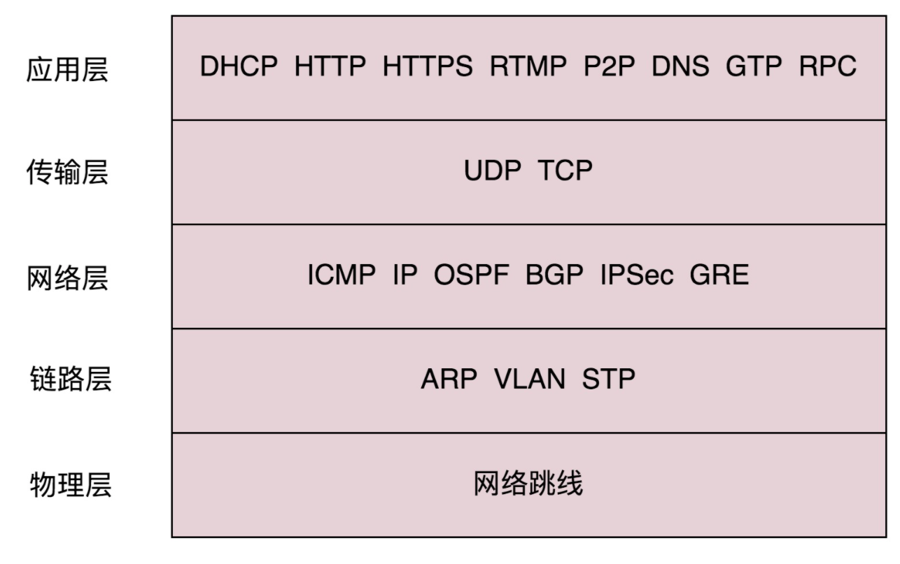
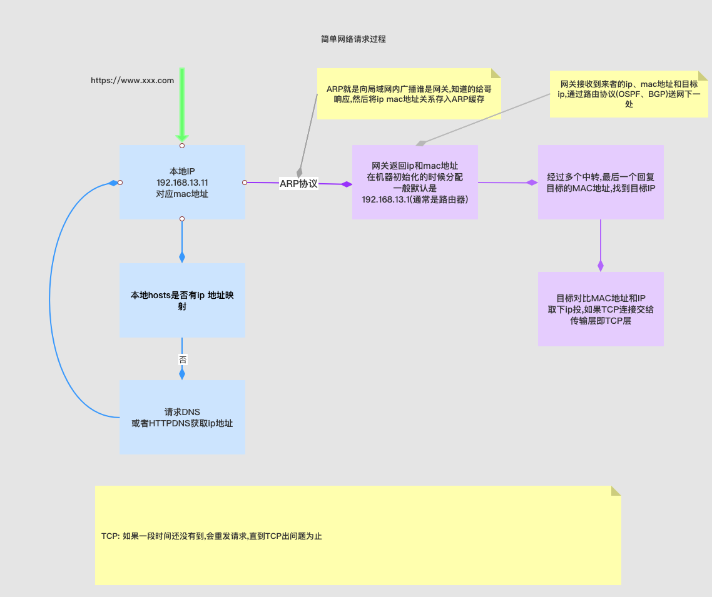
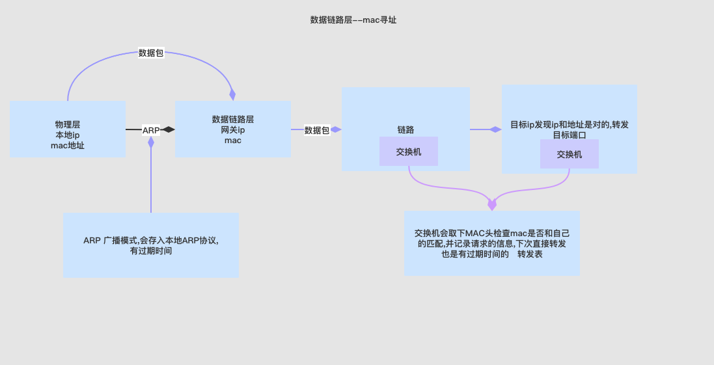
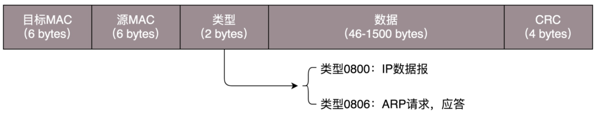
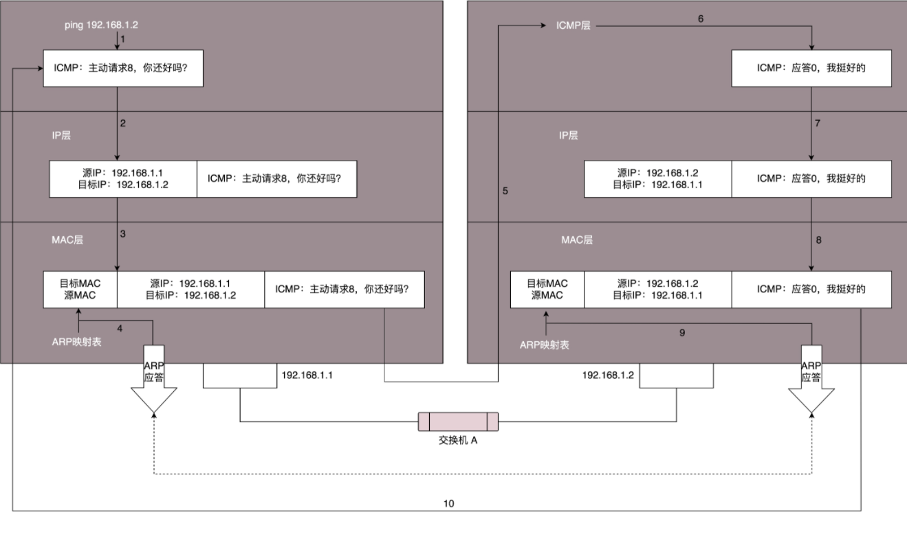
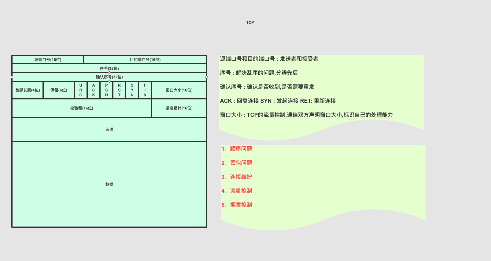
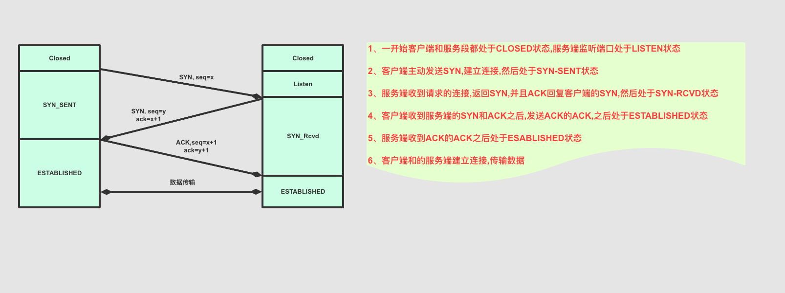
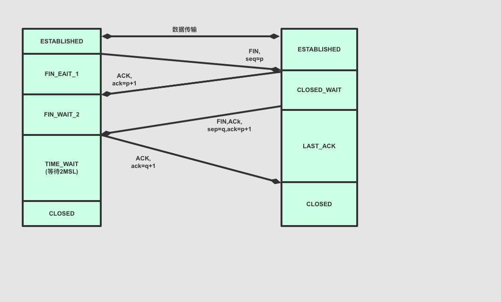
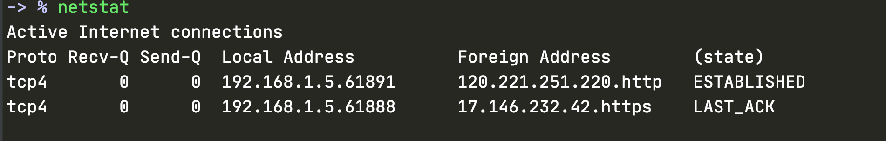

# 网络模型




## 协议三要素

- 语法
  - 就是这一段内容要符合一定的规则和格式。例如，括号要成对，结束要使用分号等。
- 语义
  - 就是这一段内容要代表某种意义。例如数字减去数字是有意义的，数字减去文本一般来说就没有意义。
- 顺序
  - 就是先干啥，后干啥。例如，可以先加上某个数值，然后再减去某个数值。


<font color=red size=5x>DNS、HTTP、HTTPS称为应用层</font>

<font color=red size=5x>TCP、UDP为传输层</font>

​	tcp有数据完整性和重发机制


# ==--网络请求大致图---==

<font color=red size=5x>当网络包到达一个城关的时候，可以通过路由表得到下一个城关的 IP 地址，直接通过 IP 地址找就可以了，为什么还要通过本地的 MAC 地址呢？</font>


1. mac地址是唯一的，为什么可以修改?想想身份证，身份证号是唯一的，不能改变的，但是可以造价。mac地址全球唯一，它是固化在网卡里的。网卡毕竟是个硬件，需要软件支持，既操作系统识别。重点来了，操作系统识别出来的mac地址是可以更改的，它只不过是一个字符串。我们常说的修改mac指的是修改电脑中记录的既注册表中的记录。
2. 有了mac地址为什么还要有ip地址。举个例子，身份证号是你的唯一标识，不会重复，一落户就有（网卡一出厂就有mac）。现在我要和你通信（写信给你），地址用你的姓名+身份证，信能送到你手上吗?明显不能！身份证号前六位能定位你出生的县。mac地址前几位也可以定位生产厂家。但是你出生后会离开这个县（哪怕在这个县，也不能具体找到你）。所以一般写个人信息就要有出生地和现居地址了





# ifconfig

查看ip地址

win

```
ipconfig
```

linux

```
ifconfig
ip addr
```


```

root@test:~# ip addr
1: lo: <LOOPBACK,UP,LOWER_UP> mtu 65536 qdisc noqueue state UNKNOWN group default 
    link/loopback 00:00:00:00:00:00 brd 00:00:00:00:00:00
    inet 127.0.0.1/8 scope host lo
       valid_lft forever preferred_lft forever
    inet6 ::1/128 scope host 
       valid_lft forever preferred_lft forever
2: eth0: <BROADCAST,MULTICAST,UP,LOWER_UP> mtu 1500 qdisc pfifo_fast state UP group default qlen 1000
    link/ether fa:16:3e:c7:79:75 brd ff:ff:ff:ff:ff:ff
    inet 10.100.122.2/24 brd 10.100.122.255 scope global eth0
       valid_lft forever preferred_lft forever
    inet6 fe80::f816:3eff:fec7:7975/64 scope link 
       valid_lft forever preferred_lft forever
```


# ip 地址的配置

```
$ sudo ifconfig eth1 10.0.0.1/24
$ sudo ifconfig eth1 up
```


```
$ sudo ip addr add 10.0.0.1/24 dev eth1
$ sudo ip link set up eth1
```


- DHCP 协议主要是用来给客户租用 IP 地址，和房产中介很像，要商谈、签约、续租，广播还不能“抢单”
- DHCP 协议能给客户推荐“装修队”PXE，能够安装操作系统，这个在云计算领域大有用处。


# 第一层--->物理层

物理层确保原始的[数据](https://baike.baidu.com/item/数据/5947370)可在各种物理媒体上传输。[局域网](https://baike.baidu.com/item/局域网/98626)与[广域网](https://baike.baidu.com/item/广域网/422004)皆属第1、2层。


# 第二层--->数据链路层


数据链路层是[OSI参考模型](https://baike.baidu.com/item/OSI参考模型/708028)中的第二层，介乎于[物理层](https://baike.baidu.com/item/物理层/4329158)和[网络层](https://baike.baidu.com/item/网络层/4329439)之间。数据链路层在物理层提供的服务的基础上向网络层提供服务，其最基本的服务是将源自网络层来的[数据](https://baike.baidu.com/item/数据/5947370)可靠地[传输](https://baike.baidu.com/item/传输/7078195)到[相邻节点](https://baike.baidu.com/item/相邻节点/22061788)的目标机网络层。

1. 这个包是发给谁的？谁应该接收？
2. 大家都在发，会不会产生混乱？有没有谁先发、谁后发的规则？
3. 如果发送的时候出现了错误，怎么办？
4. 


## mac

MAC 的全称是 Medium Access Control，即媒体访问控制。控制什么呢？其实就是控制在往媒体上发数据的时候，谁先发、谁后发的问题。防止发生混乱。这解决的是第二个问题。


比如接下来这三种方式：

- 方式一：分多个车道。每个车一个车道，你走你的，我走我的。这在计算机网络里叫作**信道划分**；
- 方式二：今天单号出行，明天双号出行，轮着来。这在计算机网络里叫作**轮流协议**；
- 方式三：不管三七二十一，有事儿先出门，发现特堵，就回去。错过高峰再出。我们叫作**随机接入协议**。著名的以太网，用的就是这个方式。


第一个问题: 发给谁,谁接收?

这里用到一个物理地址，叫作**链路层地址。但是因为第二层主要解决媒体接入控制的问题，所以它常被称为MAC 地址。**

解决第一个问题就牵扯到第二层的网络包格式。对于以太网，第二层的最开始，就是目标的 MAC 地址和源的 MAC 地址。




## ARP 获取目标MAC地址


## 交换机

<font color=red size=5x>交换机就是吧MAC头取下来,检查是否是目标地址</font>

<font color=red size=5x>交换机有学习能力,第一次,会转发除请求以外的所有口,第二次就会有记录信息,转发给目标口</font>

谁能知道目标 MAC 地址是否就是连接某个口的电脑的 MAC 地址呢？这就需要一个能把 MAC 头拿下来，检查一下目标 MAC 地址，然后根据策略转发的设备，按第二节课中讲过的，这个设备显然是个二层设备，我们称为**交换机。**


# ping的过程

- ICMP 相当于网络世界的侦察兵。我讲了两种类型的 ICMP 报文，一种是主动探查的查询报文，一种异常报告的差错报文；
- ping 使用查询报文，Traceroute 使用差错报文。




# 传输层

## UDP


<font color=red size=5x>与TCP区别</font>

- TCP是面向字节流的
- UDP继承ip协议,是基于数据报的


- TCP是有状态的服务,面向拥塞控制的根据网络情况,调整自身的行为
- UDP不是,可以发就会一直发


- TCP有包的校验和检测,面向连接的
- UDP是无连接的


### UDP的包头


## TCP

  


## 1、为什么两次握手不行

> 1. A 向 B 发送连接,可能因为网络延迟问题,发送多个才可能到达B,建立连接的时候,可能也会有之前的连接到来,这个时候是没法区分那个是有效的连接的,<font color=red size=5x>**如果都建立连接,就会浪费B的资源**</font>


> 2. 此时B的应答可能也是多次,但是只要一次到达A,A就认为建立了连接,A会发送应答之应答,而B也在等这个消息,==才能确认建立连接,避免浪费资源==


> 3. 当B挂了,A发送给B的数据会报错,A就会知道B挂了,不可达


> 4. A建立连接后开启keepalive(没有真正数据,也会有探活包) ,长时间不发包,B会在等待一段时间后,断开连接


## 2、 序号为什么不是从1连续的

> 1. A连接上B,发送1、2、3三个包,但是发送3的时候,中间丢了,于是重新发送,A连上B之后只发送1、2,又重新从1开始发送,此时上一个的3回来了,发给B,B认为这就是下一次包,于是发生错误

> 2. 每个连接都有不同的序号,<font color=red size=5x>这个序号是随着时间的变化而变化的</font>,可以看成是一个32位的计数器,没4微妙加1,如果重复,大概需要4个小时,那个绕路的包会在TTL时间之后消失


## 3、 三次握手图




## 4、四次挥手



### A、四次挥手为什么不是一次

> 如果只是A给B发送关闭,B不回复收到是否关闭,A会一直等着


### B、为什么不是两次挥手

> 如果是两次,因为B在处理别的事情,还没结束,只有等到B处理结束,然后主动通知A结束
>
> 如果此时A跑路,B会一直等待,<font color=red size=5x>TCP没有处理这种情况,Linux处增加了等待时长</font>


> 等B处理完毕,通知A可以关闭了,然后A发送ACK告诉B收到了,可以关闭
>
> 此时<font color=green size=5x>防止B没有收到,A会等待`2MSL`(最大网络报文生存时间),再次时间内没收到,会重发消息,超过最长时间则丢弃消息</font>


### C、最大报文生存时间

> 2MSL Maximum Segment Lifetime，报文最大生存时间
>
> TCP报文是基于ip协议的,二IP协议头中有TTL域,是ip经过的最大路由数,每经过一个处理它的路由器就减1,当值位0的时候数据包将被丢弃,同时发送ICMP报文通知源主机


### D、超过最大报文生存时间B发来消息

> <font color=green size=5x>**经过2MSL时间,B没有收到FIN的消息,B会重发FIN,这时候A收到这个包之后,A发现等了很久,直接发送RET,于是B知道A结束了**</font>


## 5、如何查看TCP 连接状态

可以用 netstat 或者 lsof 命令 grep 一下 establish listen close_wait 等这些查看

```
netstat
```




```
lsof
```


